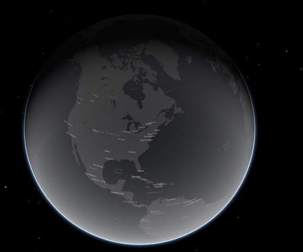

import { GlossaryRef } from './index';
import { TagLink, VariableLink } from '../components.mdx'

The `mapPortal` is a <GlossaryRef term="portal">portal</GlossaryRef> that draws bots as 3D cubes on an 3D map of the Earth.

#### See Also

- <TagLink tag="mapPortal"/>
- <VariableLink name="mapPortalBot"/>

#### Photos of gridPortal

