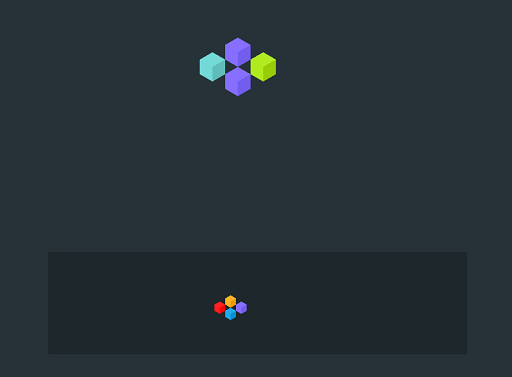

import { GlossaryRef } from './index';
import { TagLink, VariableLink } from '../components.mdx'

The `miniGridPortal` is a <GlossaryRef term="portal">portal</GlossaryRef> that draws bots as 3D cubes on an infinite grid of squares.
Unlike the <GlossaryRef term="gridPortal">gridPortal</GlossaryRef>, the `miniGridPortal` only covers the lower portion of the screen.

#### See Also

- <TagLink tag="miniGridPortal"/>
- <VariableLink name="miniGridPortal"/>

#### Photos of miniGridPortal

