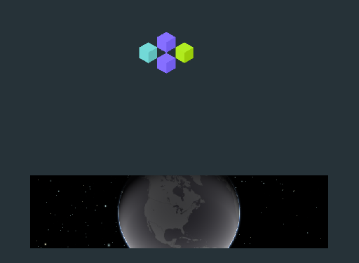

import { GlossaryRef } from './index';
import { TagLink, VariableLink } from '../components.mdx'

The `miniMapPortal` is a <GlossaryRef term="portal">portal</GlossaryRef> that draws bots as 3D cubes on an 3D map of the Earth.
Unlike the <GlossaryRef term="mapPortal">mapPortal</GlossaryRef>, the `miniMapPortal` only covers the lower portion of the screen.

#### See Also

- <TagLink tag="miniMapPortal"/>
- <VariableLink name="miniMapPortal"/>

#### Pictures of miniMapPortal

