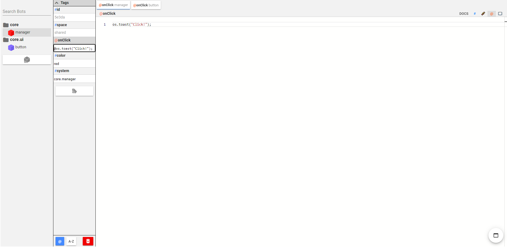

import { GlossaryRef } from './index';
import { TagLink, VariableLink } from '../components.mdx'

The systemPortal is a <GlossaryRef term="portal">portal</GlossaryRef> that makes it easy to find and edit bots by their <TagLink tag="system"/> tag.

The systemPortal organizes bots by their <TagLink tag="system"/> tag.
`#system` tags that have multiple sections split by a period (`.`) will be placed in different folders in the systemPortal.
Additionally, the "Search Bots" input box in the systemPortal can be used to filter bots by their `#system` tag.

For example, the first section might be the name of the app bundle, the second section would be the area that the bot belongs in, and the third section would be the name of the bot.
e.g. `myAppBundle.managers.timeline` would specify that a bot belongs in `myAppBundle` and is one of the manager bots.
The systemPortal would then show each bot organized by `#system` tag.

#### See Also

- <TagLink tag="system"/>
- <TagLink tag="systemPortal"/>
- <TagLink tag="systemPortalBot"/>
- <TagLink tag="systemPortalTag"/>
- <TagLink tag="systemPortalTagSpace"/>
- <VariableLink name="systemPortalBot"/>

