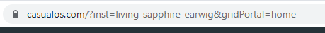
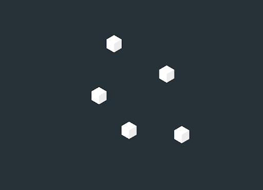
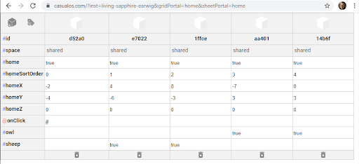
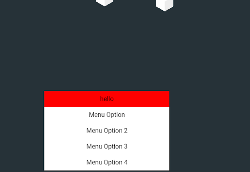
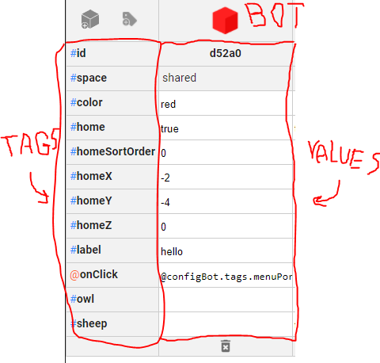
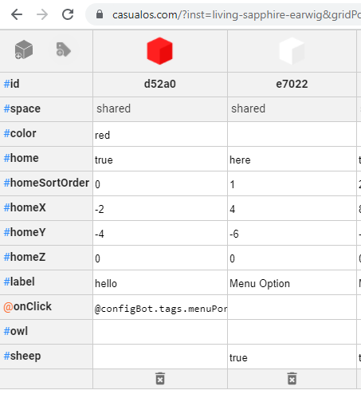
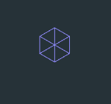
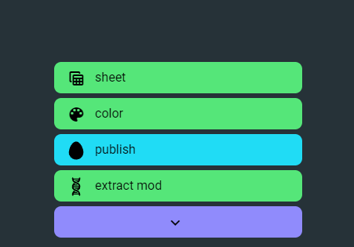
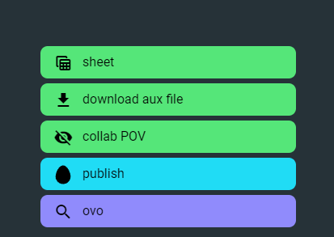

import { GlossaryRef } from '../glossary/index.jsx';

CasualOS is a combination of many pieces of open source software that allow for a quick and simple collaborative workflow.

When a new instance of CasualOS is opened it will show a screen like this:

This is what is known as the `gridPortal`. The `gridPortal` is a 3D view that uses things called <GlossaryRef term='bot'>bots</GlossaryRef> as its visual and functional components.
The way to start a new instance is to go to the related link. In my case I’ll be using [casualos.com](https://casualos.com) but you may be using [publicos.com](https://publicos.com).

When a fresh instance is created it will generate an id that makes it its own separate experience which you can see in the website bar.

In my case the <GlossaryRef term='instance'>inst</GlossaryRef> is called **living-sapphire-earwig** and the `gridPortal` we are looking at is `home`.
All the data related to this can be found at this address at any time depending on the server setup.

## Portals

In CasualOS we have a number of ways to interact with data.
Here is a list of common portals:

-   `gridPortal`
    -   The `gridPortal` is a window that allows the users to view bots oftentimes as colored boxes floating in space.
        This is usually where the main experience is located.

        

-   `sheetPortal`
    -   The `sheetPortal` is a window almost like an excel sheet that shows each of the bots and their related tags in a given context or dimension as they are called.

        

-   `menuPortal`
    -   The menuPortal is a collection of bots in the form of [HTML divs](https://developer.mozilla.org/en-US/docs/Web/HTML/Element/div) that hover over the `pagePortal`.

        

## Bots

<GlossaryRef term='bot'>Bots</GlossaryRef> are collections of data that can have visual properties.
A bot can be a button in a menu, a dice on a game board or a manager for a larger system.

This is what bots look like in the sheetPortal.

## Tags

Each bot in an experience has values called <GlossaryRef term='tag'>tags</GlossaryRef>.

Each of these tags can perform a different role in whatever your experience ends up being.
A tag is like a [JavaScript](https://javascript.info/intro) variable so it can hold just about anything as a value.

-   _You make a new tag in the `sheetPortal` by pressing the tag button that looks like a price tag._

-   _When the tag has a `true` value in it the bot can be seen in the grid portal of that variable name._
In the above image, the bot is visible in the home `gridPortal` and they have a `homeX`, `homeY` and `homeZ` location where they appear at when looking at the `gridPortal`.

-   _When you put an `@` symbol at the beginning of a tag it becomes a listener tag._
A listener tag is a tag that can be called as a function or event.
You can find the predefined listener tags in [the documentation](../listen-tags.mdx).

-   _When you put a 🧬 symbol at the beginning of a tag it becomes a mod._
A mod tag is a tag that holds array and json data in a way CasualOS can read it.

## Links

CasualOS becomes easier to navigate when we have a better understanding of what’s going on in the website bar.

In this example we are in the instance or  <GlossaryRef term='instance'>inst</GlossaryRef> **living-sapphire-earwig**.
This is the id/name of the project you are working in.
If that is removed from the link you will create a new project on pressing enter.

Also in the link is `gridPortal=home`.
This is the  <GlossaryRef term='dimension'>3D Dimension</GlossaryRef> you are looking at.
If you change the value for `gridPortal` to something else like `house` or `car` or `road` it'll show you the bots that have _those tags set to true_.

If you were to add `&sheetPortal=home` to the link you can view the `home` dimension's information.
In the `sheetPortal` you can view any bots that have any values in that dimensional tag.

In the case below we are looking at the `home` dimension in the `sheetPortal`.
The bot on the left has the `home` tag set to `true` so it is visible in both `gridPortal=home` and the `sheetPortal=home` 
but the bot on the right has the value "here" in it so it's only visible in `sheetPortal=home`.

## ab-1

<GlossaryRef term='ab-1'>ab-1</GlossaryRef> is a tool we have been developing to help with the understanding of and general use of CasualOS.

When making a new instance ab-1 will appear right in the center of the screen.
ab-1 is a piece of CasualWare that has an extensive number of options to help with any project you may have.
At any time you can click on any space in the `gridPortal` that doesn’t have a bot on it and create a footprint.
Clicking on a footprint before it disappears mankes ab-1 appear.

When you drag off from ab-1 you will get a little drag widget and when you release it over anything you will get context sensitive menus that will allow you to modify or create bots.
This is helpful for getting information from things within the `gridPortal`.

If you click right on ab-1 you get this menu.
Here you can click to open the `sheetPortal` of the currently open `gridPortal` or download or upload the current version of the software you are creating.

