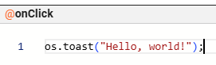

## Introduction

CasualOS is a powerful platform for creating interactive, collaborative experiences using bots. Bots are the fundamental building blocks in CasualOS - they're objects that contain data (stored in **tags**) and behavior (defined in **listen tags**).

This tutorial will teach you the basics of CasualOS scripting, including:
- How to respond to events using listen tags
- How to create and destroy bots
- How to search for and modify bots
- How to use common CasualOS functions

## Listen Tags: Adding Behavior to Bots

### What are Listen Tags?

**[Listen tags](../tags/listen.mdx)** are special tags whose values start with the `@` symbol. They contain [JavaScript](https://javascript.info/) scripts that run in response to specific events. Think of them as event handlers that give your bots behavior.

For example:
```javascript
@os.toast("Hello, world!");
```

When this listen tag is triggered, it will display a toast message to the user.

When viewing a listen tag in the CasualOS editor (either in the sheetPortal or systemPortal), the `@` symbol is omitted from the editor and shown in the tag name, like this:



From now on, whenever we refer to a listen tag, we will include the `@` symbol in the tag name instead of in the script value.

### Common Listen Tags

CasualOS provides many [built-in listen tags](../tags/listen.mdx). Here are some of the most commonly used ones:

#### `@onClick`

[documentation link](../tags/listen.mdx#onclick)

The `@onClick` tag runs when a user clicks on a bot.

```javascript title="@onClick"
os.toast("You clicked me!");
```

**Example**: Create a counter bot that tracks how many times it's been clicked.

```javascript title="@onClick"
tags.count = (tags.count || 0) + 1;
os.toast("Clicked " + tags.count + " times");
```

#### `@onCreate`
[documentation link](../tags/listen.mdx#oncreate)

The `@onCreate` tag runs once when a bot is first created.

```javascript title="@onCreate"
os.toast("Bot created!");
tags.createdAt = new Date().toISOString();
```

**Use cases**:
- Initialize default values
- Set up bot relationships
- Log creation events

#### `@onInstJoined`

[documentation link](../tags/listen.mdx#oninstjoined)

The `@onInstJoined` tag runs when a user first joins an inst (instance/workspace).

```javascript title="@onInstJoined"
os.toast("Welcome to " + that.inst + "!");
```

**Use cases**:
- Welcome messages
- Initialize user-specific data
- Set up the initial scene

#### `@onKeyDown`

[documentation link](../tags/listen.mdx#onkeydown)

The `@onKeyDown` tag runs when a user presses a keyboard key. The event provides information about which keys were pressed.
```javascript
if (that.keys.includes('Enter')) {
    os.toast("You pressed Enter!");
}

if (that.keys.includes('Escape')) {
    os.toast("You pressed Escape!");
}
```

**Useful properties**:
- `that.keys`: Array of all currently pressed keys

## Creating and Destroying Bots

### Creating Bots with `create()`

The `create()` function creates a new bot with the specified tags.

**Basic syntax**:
```javascript
create(tags)
```

**Examples**:

```javascript
// Create a simple bot
const bot = create({
    name: "My Bot",
    color: "#ff0000"
});
```

```javascript
// Create a bot with behavior
const counter = create({
    name: "Counter",
    count: 0,
    onClick: "@tags.count += 1; os.toast('Count: ' + tags.count);"
});
```

```javascript
// Create a bot and position it in 3D space
const cube = create({
    shape: "cube",
    color: "#00ff00",
    position: { x: 0, y: 0, z: 0 },
    scale: 2
});
```

### Destroying Bots with `destroy()`

The `destroy()` function removes a bot from the inst.

**Basic syntax**:
```javascript
destroy(bot)
```

**Examples**:

```javascript
// Destroy the current bot
destroy(thisBot);
```

```javascript
// Create and then destroy a bot after 5 seconds
const bot = create({
    name: "Temporary Bot"
});

os.sleep(5000).then(() => {
    destroy(bot);
    os.toast("Bot destroyed!");
});
```

```javascript
// Destroy all bots with a specific tag
const bots = getBots("type", "temporary");
for (let bot of bots) {
    destroy(bot);
}
```

## Finding Bots

CasualOS provides several functions to search for bots in your inst.

### `getBot(tag, value)`

Returns the **first bot** that has the specified tag with the given value. Returns `null` if no bot is found.

**Examples**:

```javascript
// Find a bot by name
const player = getBot("name", "Player");
if (player) {
    os.toast("Found player: " + player.id);
}
```

```javascript
// Find a bot by custom tag
const mainMenu = getBot("type", "menu");
if (mainMenu) {
    mainMenu.tags.visible = true;
}
```

### `getBots(tag, value)`

Returns an **array of all bots** that have the specified tag with the given value.

**Examples**:

```javascript
// Find all enemy bots
const enemies = getBots("type", "enemy");
os.toast("Found " + enemies.length + " enemies");
```

```javascript
// Find and modify all red bots
const redBots = getBots("color", "#ff0000");
for (let bot of redBots) {
    bot.tags.color = "#0000ff"; // Change to blue
}
```

### `getBots(...filters)`

Returns an **array of bots** that match the given filter criteria. This is the most flexible search method.

[List of filters](../actions/bot-filters.mdx)

**Common filters**:
- `byTag(tag, value)`: Match bots with a specific tag value
- `inDimension(dimension)`: Match bots in a specific dimension
- `byMod(bot)`: Match bots that have the given bot as a mod
- Custom filter functions

**Examples**:

```javascript
// Find bots using multiple criteria
const bots = getBots(
    byTag("type", "enemy"),
    byTag("active", true)
);
```

```javascript
// Find bots in a specific dimension
const menuBots = getBots(inDimension("menu"));
```

```javascript
// Use a custom filter function
const largeBots = getBots(bot => {
    return bot.tags.scale && bot.tags.scale > 5;
});
```

```javascript
// Combine multiple filters
const activePlayers = getBots(
    byTag("type", "player"),
    bot => bot.tags.health > 0
);
```

## Modifying Bot Data

### Using `bot.tags`

The `tags` property provides access to a bot's data. You can read and write tag values directly.

**Reading tags**:
```javascript
const name = thisBot.tags.name;
const position = thisBot.tags.position;
const health = thisBot.tags.health || 100; // Default value if tag doesn't exist
```

**Writing tags**:
```javascript
thisBot.tags.name = "New Name";
thisBot.tags.color = "#ff0000";
thisBot.tags.score = 100;
```

**Deleting tags**:
```javascript
delete thisBot.tags.temporaryData;

// or set to null
thisBot.tags.temporaryData = null;
```

**Example - Update health system**:
```javascript
// On hit
tags.health = (tags.health || 100) - 10;

if (tags.health <= 0) {
    os.toast("Bot destroyed!");
    destroy(thisBot);
} else {
    os.toast("Health: " + tags.health);
}
```

### Using `bot.masks`

**Masks** are temporary tag values that override the bot's actual tag values without permanently changing them. They're useful for:
- Temporary visual changes
- User-specific views
- Testing different values

**Mask spaces**:
- `tempLocal`: Visible only to the current user, cleared on refresh (default space)
- `local`: Visible only to the current user, persists across refresh
- `tempShared`: Visible to all users, cleared on refresh

**Examples**:

```javascript
// Apply a temporary color change
thisBot.masks.color = "#ff0000";
```

```javascript
// Set a user-specific mask
setTagMask(thisBot, 'customData', "Only I can see this", 'tempLocal');
```

```javascript
// Clear a mask
delete thisBot.masks.color;
```

```javascript
// Highlight bots temporarily for current user
const bots = getBots("type", "target");
for (let bot of bots) {
    bot.masks.color = "#ffff00"; // Yellow highlight
}

// Clear after 3 seconds
os.sleep(3000).then(() => {
    for (let bot of bots) {
        delete bot.masks.color;
    }
});
```

## Common CasualOS Functions

### `os.toast(message)`

Displays a temporary message to the user at the bottom of the screen.

```javascript
os.toast("Hello, CasualOS!");
```

```javascript
os.toast("Score: " + tags.score);
```

### `shout(eventName, arg?)`

Sends an event to all bots that have a listener tag for that event. This is a broadcast mechanism that allows bots to communicate with each other.

**Basic usage**:
```javascript
shout("myEvent");
```

**With arguments**:
```javascript
shout("onPlayerScored", { points: 10, player: thisBot });
```

**Examples**:

```javascript
// Bot A - Trigger event on click
shout("onGameStarted");
```

```javascript
// Bot B - Listen for the event
// Add this to a bot's onGameStarted tag
os.toast("The game has started!");
tags.gameActive = true;
```

```javascript
// Advanced - Pass data with the event
// In a player bot's onClick
shout("onPlayerClicked", {
    playerId: thisBot.id,
    playerName: tags.name,
    timestamp: Date.now()
});
```

```javascript
// Any bot can listen for onPlayerClicked
// The event data is available in 'that'
os.toast(that.playerName + " was clicked!");
```

**Use cases**:
- Triggering game events (start, pause, reset)
- Broadcasting state changes to all bots
- Coordinating multiple bots simultaneously
- Implementing game mechanics (explosions, power-ups, etc.)

### `whisper(bot, eventName, arg?)`

Sends an event to a specific bot or array of bots. Unlike `shout()`, which broadcasts to all bots, `whisper()` targets specific bots.

**Basic syntax**:
```javascript
whisper(bot, eventName)
whisper(bot, eventName, argument)
whisper([bot1, bot2, bot3], eventName)
```

**Examples**:

```javascript
// Send event to a specific bot
const player = getBot("type", "player");
if (player) {
    whisper(player, "onTakeDamage", { amount: 10 });
}
```

```javascript
// Bot receiving the whisper (in onTakeDamage tag)
tags.health = (tags.health || 100) - that.amount;
os.toast("Took " + that.amount + " damage. Health: " + tags.health);

if (tags.health <= 0) {
    destroy(thisBot);
}
```

```javascript
// Send event to multiple bots
const enemies = getBots("type", "enemy");
whisper(enemies, "onAlert", { threat: thisBot });
```

```javascript
// Enemies respond (in onAlert tag)
tags.target = that.threat;
tags.state = "attacking";
os.toast("Enemy alerted!");
```

```javascript
// Call a bot's own event
whisper(thisBot, "initialize");
```

**Use cases**:
- Direct communication between specific bots
- Triggering private events
- Sending targeted notifications
- Implementing bot-to-bot interactions (trading, messaging, etc.)
- Reusing event handlers (e.g., calling onCreate again to reinitialize)

**Difference between `shout()` and `whisper()`**:
- `shout()` broadcasts to **all bots** with the listener tag
- `whisper()` sends to **specific bot(s)** you choose

### `ai.chat(options)`

Sends a message to an AI assistant and receives a response. Supports various AI providers.

**Basic usage**:
```javascript
const response = await ai.chat([
    { role: "user", content: "What is the capital of France?" }
]);

os.toast("AI says: " + response.content);
```

**With context**:
```javascript
const response = await ai.chat([
    { role: "system", content: "You are a helpful game master." },
    { role: "user", content: "Describe a mysterious forest." }
]);

const description = response.content;
os.toast(description);
```

**Example - AI-powered NPC**:
```javascript
// Store conversation history on the bot
tags.conversation = tags.conversation || [];

// Add user input
tags.conversation.push({
    role: "user",
    content: that.message
});

// Get AI response
const response = await ai.chat([
    { role: "system", content: "You are a wise wizard in a fantasy world." },
    ...tags.conversation
]);

const aiMessage = response.content;

// Store AI response
tags.conversation.push({
    role: "assistant",
    content: aiMessage
});

// Display response
os.toast(aiMessage);
```

### `os.focusOn(botOrPosition)`

Moves the camera to focus on a specific bot or position.

**Focus on a bot**:
```javascript
const target = getBot("name", "Target");
if (target) {
    os.focusOn(target);
}
```

**Focus on a position**:
```javascript
os.focusOn({ x: 0, y: 0, z: 0 });
```

**Focus with camera rotation**:
```javascript
os.focusOn(target, {
    rotation: { x: 0, y: 45, z: 0 },
    zoom: 2
});
```

## Putting It All Together

Here's a complete example that demonstrates all the concepts covered in this tutorial:

```javascript
// Create a game manager bot
const gameManager = create({
    name: "Game Manager",
    score: 0,
    
    // Initialize game when inst is joined
    onInstJoined: `@
        os.toast("Welcome to the game!");
        
        // Create some target bots
        for (let i = 0; i < 5; i++) {
            create({
                type: "target",
                color: "#ff0000",
                home: true,
                homePosition: new Vector3(
                    Math.random() * 10 - 5, 
                    Math.random() * 10 - 5, 
                    0
                ),
                onClick: "@shout('onTargetClicked', thisBot);"
            });
        }
        
        os.focusOn({ x: 5, y: 5, z: 0 });
    `,
    
    // Handle target clicks
    onTargetClicked: `@
        const target = that;
        
        // Update score
        thisBot.tags.score += 10;
        
        // Visual feedback
        target.masks.color = "#00ff00";
        os.toast("Hit! Score: " + thisBot.tags.score);
        
        // Destroy target after delay
        os.sleep(500).then(() => {
            destroy(target);
            
            // Check if all targets destroyed
            const remaining = getBots("type", "target");
            if (remaining.length === 0) {
                os.toast("Game complete! Final score: " + thisBot.tags.score);
            }
        });
    `,
    
    // Reset game on key press
    onKeyDown: `@
        if (that.key === 'r') {
            // Destroy all targets
            const targets = getBots("type", "target");
            destroy(targets);
            
            // Reset score
            tags.score = 0;
            
            // Recreate targets
            whisper(thisBot, "onInstJoined");
        }
    `
});
```

## Next Steps

Now that you understand the basics of CasualOS scripting, you can:

- Explore the [Tags reference](../tags.mdx) for all available bot properties
- Check out [Listen Tags](../tags/listen.mdx) for a complete list of event handlers
- Review [Actions](../actions/data.mdx) for all available CasualOS functions
- Watch the [Pillars of Casual Simulation](./pillars.mdx) video tutorials for in-depth examples

## Tips and Best Practices

1. **Use meaningful tag names**: Choose descriptive names for your tags to make your code easier to understand.

2. **Initialize with default values**: Use `||` to provide default values:
   ```javascript
   tags.count = tags.count || 0;
   ```

3. **Clean up after yourself**: Destroy temporary bots when they're no longer needed.

4. **Use masks for temporary changes**: Use `bot.masks` instead of `bot.tags` when you want temporary modifications.

5. **Handle missing bots gracefully**: Always check if `getBot()` returns `null`:
   ```javascript
   const bot = getBot("name", "Player");
   if (bot) {
       // Safe to use bot here
   }
   ```

6. **Use comments**: Add comments to explain complex logic in your listen tags.

7. **Test incrementally**: Build your scripts step by step, testing each part as you go.

Happy scripting!