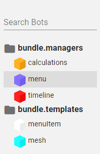

import { 
  Badges,
  Badge,
  ReadOnlyBadge,
  VideoBadge,
  PossibleValuesTable,
  PossibleValueCode,
  PossibleValue,
  LabelAnchorValues,
  AnyColorValues,
  Alert,
  ActionLink,
  TagLink,
  NormalCode,
  ConfigBotBadge,
  HistoryBotBadge,
  AutomaticBadge,
  GridPortalBadge,
  MiniGridPortalBadge,
  MiniMapPortalBadge,
  MenuPortalBadge,
  MeetPortalBadge,
  LeftWristPortalBadge,
  RightWristPortalBadge,
  SheetPortalBadge,
  TagPortalBadge,
  Example,
  AnyCursorValues,
} from './components.mdx';

import { GlossaryRef } from './glossary/index';

CasualOS has many tags.

## Info Tags

### `id`

<Badges>
  <ReadOnlyBadge/>
  <VideoBadge url='https://youtu.be/LFNExI6WgFw' />
</Badges>

The ID of the bot.

Every bot has an automatically generated unique ID that cannot be changed.

### `space`

<Badges>
  <ReadOnlyBadge/>
  <Example code='space'/>
</Badges>

The space the bot lives in.

Every bot is stored in a space that specifies how long the bot lives and if it is shared with other people.

#### Possible values are:

<PossibleValuesTable>
  <PossibleValueCode value='shared'>
    The bot is saved in the inst and is shared with everyone else. (default)
  </PossibleValueCode>
  <PossibleValueCode value='local'>
    The bot is saved on the device it was created from and is not shared with other devices.
  </PossibleValueCode>
  <PossibleValueCode value='tempLocal'>
    The bot is not saved (it is temporary) and is not shared with other sessions.
    When the current session is closed (by refreshing or closing the tab), the bot is destroyed.
  </PossibleValueCode>
  <PossibleValueCode value='tempShared'>
    The bot is not saved (it is temporary) and is shared with everyone else.
    Bots in this space show up in the `remoteTempShared` space to other devices.
    Only the current session can create, edit, and destroy bots in this space.
    When the current session is closed, the bot is destroyed.
  </PossibleValueCode>
  <PossibleValueCode value='remoteTempShared'>
    The bot is not saved (it is temporary) and is shared with everyone else.
    Bots appear in this space when another remote puts a bot in their `tempShared` space.
    Only the other remote's session can create, edit, and destroy bots in this space.
    When the other remote's session is closed, the bot is destroyed.
  </PossibleValueCode>
  <PossibleValueCode value='history'>
    The bot represents a mark (save point).
    The history space is not available by default.
    You need to use the <ActionLink action='server.browseHistory()'/> function to load it.
    Additionally, the history space is read-only. This means that bots cannot be added or removed from it and they also cannot be edited.
  </PossibleValueCode>
  <PossibleValueCode value='admin'>
    The bot is saved on the server and is shared across all instances.
    Admin space is initially locked whenever a new session starts. While locked, it is impossible to create, update, or destroy bots in the admin space.
    You must use the <ActionLink action='adminSpace.unlock(password)'/> function to unlock it.
  </PossibleValueCode>
  <PossibleValueCode value='certified'>
    The bot represents a <a href="https://en.wikipedia.org/wiki/Public_key_certificate">cryptographic certificate</a>.
    Certified bots cannot be edited or destroyed using traditional means.
    Instead, you can create and destroy certificates using the <ActionLink action='crypto.createCertificate(certificate, password, keypair)'/> and 
    <ActionLink action='crypto.revokeCertificate(certificate, password, signer?)'/> functions.
  </PossibleValueCode>
</PossibleValuesTable>


#### Record Spaces

Records can be stored in spaces as well. Like bot spaces, record spaces determine how long the record lives and if it is shared with other people.

#### Possible values are:

<PossibleValuesTable>
  <PossibleValueCode value='tempRestricted'>
    The record is saved but will be deleted at the end of the day and is only retrievable by the user and appBundle that created them. (default)
  </PossibleValueCode>
  <PossibleValueCode value='tempGlobal'>
    The record is saved but will be deleted at the end of the day and it is shared with everyone.
  </PossibleValueCode>
  <PossibleValueCode value='permanentRestricted'>
    The record is saved and is only retrievable by the user and appBundle that created them.
  </PossibleValueCode>
  <PossibleValueCode value='permanentGlobal'>
    The record is saved and is shared with everyone.
  </PossibleValueCode>
</PossibleValuesTable>

### `creator`

<Badges>
  <VideoBadge url='https://youtu.be/LFNExI6WgFw' />
</Badges>

The ID of the bot that created this bot.
The creator bot must be in the same space as this bot.

## Behavior Tags

These tags affect how CasualOS allows the users to interact with bots.

### `draggable`

Whether the bot is able to be moved by the built-in CasualOS system.

Note that this value only controls whether CasualOS can move bots automatically as the result of user interaction.
If set to `false`, then CasualOS will not change any tags, but it will still send events for the bot (e.g. <ActionLink action='@onDrag'/>, <ActionLink action='@onAnyBotDrag'/>, <ActionLink action='@onDrop'/>, <ActionLink action='@onAnyBotDrop'/>, etc.).

#### Possible values are:

<PossibleValuesTable>
  <PossibleValueCode value='true'>
    The bot is able to be dragged. (default)
  </PossibleValueCode>
  <PossibleValueCode value='false'>
    The bot cannot be dragged.
  </PossibleValueCode>
</PossibleValuesTable>

### `pointable`

Whether the bot interacts with the pointer.

Bots that are pointable can receive clicks, pointer enter/exit, and drop events.
Note that the <TagLink tag='pointable'/> tag also affects whether the content inside an [iframe form](#iframe-form) is interactable.

#### Possible values are:

<PossibleValuesTable>
  <PossibleValueCode value='true'>
    The bot interacts with the pointer. (default)
  </PossibleValueCode>
  <PossibleValueCode value='false'>
    The bot does not interact with the pointer.
  </PossibleValueCode>
</PossibleValuesTable>

### `focusable`

Whether the bot is able to be focused.

Bots that are focusable can receive focus events like <TagLink tag='@onFocusEnter'/>.

#### Possible values are:

<PossibleValuesTable>
  <PossibleValueCode value='true'>
    The bot is focusable. (default)
  </PossibleValueCode>
  <PossibleValueCode value='false'>
    The bot is not focusable.
  </PossibleValueCode>
</PossibleValuesTable>

### `destroyable`

Whether the bot is able to be destroyed.

#### Possible values are:

<PossibleValuesTable>
  <PossibleValueCode value='true'>
    The bot will be able to be destroyed. (default)
  </PossibleValueCode>
  <PossibleValueCode value='false'>
    The bot will not be able to be destroyed.
  </PossibleValueCode>
</PossibleValuesTable>

### `editable`

Whether the bot is able to be edited in the sheet in Channel Designer.

<Alert type='warning'>
  <strong>Use with caution.</strong> Once you set <TagLink tag='editable'/> to <NormalCode>false</NormalCode>, you can't edit the bot via the sheet.
</Alert>

#### Possible values are:

<PossibleValuesTable>
  <PossibleValueCode value='true'>
    The bot can be edited via the sheet. (default)
  </PossibleValueCode>
  <PossibleValueCode value='false'>
    The bot cannot be edited via the sheet. (including being able to set editable back to true)
  </PossibleValueCode>
</PossibleValuesTable>

### `listening`

Determines whether this bot responds to whispers or shouts. If this tag is set to `true` it will respond to them. If set to `false`, it will not.

#### Possible values are:

<PossibleValuesTable>
  <PossibleValueCode value='true'>
    The bot will respond to whispers and shouts. (default)
  </PossibleValueCode>
  <PossibleValueCode value='false'>
    The bot will not respond to whispers or shouts.
  </PossibleValueCode>
</PossibleValuesTable>

### `system`

The "system" that this bot represents. Bots with a `#system` tag will be able to appear in the <GlossaryRef term='systemPortal'>systemPortal</GlossaryRef>.
The you can kinda think of the `#system` tag as the name that the systemPortal uses for bots.
`#system` tag values should ideally be three sections separated by a `.`.

For example, the first section might be the name of the app bundle, the second section would be the area that the bot belongs in, and the third section would be the name of the bot.
e.g. `myAppBundle.managers.timeline` would specify that a bot belongs in `myAppBundle` and is one of the manager bots.
The systemPortal would then show each bot organized by `#system` tag.



#### Possible values are:

<PossibleValuesTable>
  <PossibleValueCode value='null'>(default)</PossibleValueCode>
  <PossibleValue value='Any String'>The system that this bot belongs to.</PossibleValue>
</PossibleValuesTable>

## Visualization Tags

These tags change how CasualOS displays bots.

### `color`

<Badges>
  <VideoBadge url='https://youtu.be/tV4xJJjxDkE' />
</Badges>

The color of the bot.

#### Possible values are:

<PossibleValuesTable>
  <PossibleValueCode value='white'>
    (default)
  </PossibleValueCode>
  <AnyColorValues/>
  <PossibleValueCode value='clear'>
    The bot's body will be invisible.
  </PossibleValueCode>
</PossibleValuesTable>

### `cursor`

The cursor that should be used when the mouse pointer is hovering over the bot in the bot and menu portals.

Note that when using a custom cursor image, the image should be 32x32 pixels or smaller.
This is because that is the largest cursor image size that some operating systems support.

#### Possible values are:

<PossibleValuesTable>
  <AnyCursorValues/>
</PossibleValuesTable>

### `cursorHotspotX`
<Badges>
    <GridPortalBadge/>
    <MiniGridPortalBadge/>
</Badges>

The X position of the pixel in the cursor image that is the "hotspot".
That is, the pixel which represents the point or tip of the cursor.

The top left of the image is (0, 0).

#### Possible values are:
<PossibleValuesTable>
  <PossibleValueCode value='0'>(default)</PossibleValueCode>
  <PossibleValue value='Any Number > 0'>The X position that the cursor hotspot should be at.</PossibleValue>
</PossibleValuesTable>

### `cursorHotspotY`
<Badges>
    <GridPortalBadge/>
    <MiniGridPortalBadge/>
</Badges>

The Y position of the pixel in the cursor image that is the "hotspot".
That is, the pixel which represents the point or tip of the cursor.

The top left of the image is (0, 0).

#### Possible values are:
<PossibleValuesTable>
  <PossibleValueCode value='0'>(default)</PossibleValueCode>
  <PossibleValue value='Any Number > 0'>The Y position that the cursor hotspot should be at.</PossibleValue>
</PossibleValuesTable>

### `strokeColor`

The color of the bot's outline.

#### Possible values are:

<PossibleValuesTable>
  <PossibleValueCode value='clear'>
    (default)
  </PossibleValueCode>
  <AnyColorValues/>
</PossibleValuesTable>

### `strokeWidth`

The width of the bot's outline.

### `lineTo`

The bot, bot ID, list of bots, or list of bot IDs that this bot should draw lines to.

### `lineStyle`

The style of the lines.

#### Possible values are:

<PossibleValuesTable>
  <PossibleValueCode value='line'>
    Displays the line without additional decoration. (Default)
  </PossibleValueCode>
  <PossibleValueCode value='arrow'>
    Displays the line with an arrow at the tip pointing to the target bot.
  </PossibleValueCode>
  <PossibleValueCode value='wall'>
    Displays the line as a vertical wall.
  </PossibleValueCode>
</PossibleValuesTable>

### `lineWidth`

The width of the lines from this bot.

#### Possible values are:

<PossibleValuesTable>
  <PossibleValueCode value='1'>
    The width of the line is 1 unit. (default)
  </PossibleValueCode>
  <PossibleValue value='Any Number > 0'>
    The width of the line is the given size.
  </PossibleValue>
</PossibleValuesTable>

### `lineColor`

The color of the lines.

#### Possible values are:

<PossibleValuesTable>
  <PossibleValueCode value='white'>
    (default)
  </PossibleValueCode>
  <AnyColorValues/>
</PossibleValuesTable>

### `label`

<Badges>
  <VideoBadge url='https://youtu.be/rWyJ1A42BFA' />
</Badges>

The text that the bot should show in a label.

### `labelColor`

<Badges>
  <VideoBadge url='https://youtu.be/tNlH0gx7OBQ' />
</Badges>

The color of the text in the label.

#### Possible values are:

<PossibleValuesTable>
  <PossibleValueCode value='black'>
    (default)
  </PossibleValueCode>
  <AnyColorValues/>
</PossibleValuesTable>

### `labelOpacity`

The opacity of the text in the label.

#### Possible values are:

<PossibleValuesTable>
  <PossibleValueCode value='1'>
    (default)
  </PossibleValueCode>
  <PossibleValue value='Any Number >= 0 and <= 1'>
    The label will use the given opacity.
  </PossibleValue>
</PossibleValuesTable>

### `labelFontSize`

The font size of the text in the label.
Changing this value scales the text characters in the label which changes the text layout.

#### Possible values are:

<PossibleValuesTable>
  <PossibleValueCode value='auto'>
    The label font size is automatically scaled to fit the text in the bot. (Default)
  </PossibleValueCode>
  <PossibleValue value='Any Number > 0'>
    The label will use the given font size.
  </PossibleValue>
</PossibleValuesTable>

### `labelPadding`

The amount of space that should be between the edge of the bot and the edge of the label.
Units are in grid spaces.

When <TagLink tag='labelFontSize'/> is set to `auto`, this setting affects both the label height and width.
Otherwise, it only affects the width.

#### Possible values are:

<PossibleValuesTable>
  <PossibleValueCode value='0'>
    There is no space between the edge of the bot and the edge of the label. (Default)
  </PossibleValueCode>
  <PossibleValue value='Any Number > 0'>
    The label is sized so that it fits in the space provided by the bot minus the padding.
  </PossibleValue>
</PossibleValuesTable>

### `labelPaddingX`

The amount of space that should be between the side of the bot and the side of the label.
Units are in grid spaces.

This tag is similar to <TagLink tag='labelPadding'/> except that it only affects the width of the label.

#### Possible values are:

<PossibleValuesTable>
  <PossibleValueCode value='0'>
    There is no space between the edge of the bot and the edge of the label. (Default)
  </PossibleValueCode>
  <PossibleValue value='Any Number > 0'>
    The label is sized so that it fits in the space provided by the bot minus the padding.
  </PossibleValue>
</PossibleValuesTable>

### `labelPaddingY`

The amount of space that should be between the top of the bot and the top of the label.
Units are in grid spaces.

This tag is similar to <TagLink tag='labelPadding'/> except that it only affects the height of the label.
As such, this tag only has an effect when <TagLink tag='labelFontSize'/> is set to `auto`.

#### Possible values are:

<PossibleValuesTable>
  <PossibleValueCode value='0'>
    There is no space between the edge of the bot and the edge of the label. (Default)
  </PossibleValueCode>
  <PossibleValue value='Any Number > 0'>
    The label is sized so that it fits in the space provided by the bot minus the padding.
  </PossibleValue>
</PossibleValuesTable>

### `labelSize`

<Badges>
  <VideoBadge url='https://youtu.be/ql5R8t6RP-c' />
</Badges>

The size of the label. Default is 1.
Changing this value scales the label text in size without changing the text layout.
This is useful for floating labels where you want the bubble to be larger without changing the size of the font.

### `labelSizeMode`

The sizing mode for the label.

#### Possible values are:

<PossibleValuesTable>
  <PossibleValueCode value='normal'>
    Don't automatically scale the label size. (default)
  </PossibleValueCode>
  <PossibleValueCode value='auto'>
    Automatically scale the label to keep the same size on the screen.
  </PossibleValueCode>
</PossibleValuesTable>

### `labelPosition`

<Badges>
  <VideoBadge url='https://youtu.be/0P87qsLexW0' />
</Badges>

The anchor position for the label.

#### Possible values are:

<PossibleValuesTable>
  <LabelAnchorValues/>
</PossibleValuesTable>

### `labelAlignment`

The text alignment for the label.

#### Possible values are:

<PossibleValuesTable>
  <PossibleValueCode value='center'>
    The text is aligned around the center of the face that the label is anchored to. (default)
  </PossibleValueCode>
  <PossibleValueCode value='left'>
    The text is aligned on the left side of the face that the label is anchored to.
  </PossibleValueCode>
  <PossibleValueCode value='right'>
    The text is aligned on the right side of the face that the label is anchored to.
  </PossibleValueCode>
</PossibleValuesTable>

### `labelFontAddress`

The address of the font that the label should use.

If the current font does not support a specific character, the character will be displayed as a crossed out box (i.e. `☒`).

#### Possible values are:

<PossibleValuesTable>
  <PossibleValueCode value='roboto'>
    Specifies that the <a href="https://fonts.google.com/specimen/Roboto">Roboto</a> font should be used. (default)
  </PossibleValueCode>
  <PossibleValueCode value='noto-sans-kr'>
    Specifies that the <a href="https://fonts.google.com/specimen/Noto+Sans+KR">Noto Sans KR</a> font should be used.
    This is a font with support for the Korean language.
  </PossibleValueCode>
  <PossibleValue value='Any URL'>
    Specifies that the font to be used should be downloaded from the given URL.
    Currently supports <a href="https://en.wikipedia.org/wiki/Web_Open_Font_Format">WOFF</a> and <a href="https://en.wikipedia.org/wiki/OpenType">OTF</a> fonts.
  </PossibleValue>
</PossibleValuesTable>

### `labelWordWrapMode`

The word wrapping mode that the label should use. Useful for automatically fitting the text onto the bot.

#### Possible values are:

<PossibleValuesTable>
  <PossibleValueCode value='breakCharacters'>
    Line breaks may be inserted inside a word to fit the label on the bot. (default)
  </PossibleValueCode>
  <PossibleValueCode value='breakWords'>
    Line breaks may be inserted between words to fit the label on the bot.
  </PossibleValueCode>
  <PossibleValue value='none'>
    Line breaks will not be inserted.
  </PossibleValue>
</PossibleValuesTable>

### `scale`

<Badges>
  <VideoBadge url='https://youtu.be/DOxixU-C_0g' />
</Badges>

The uniform scale of the bot.

Defaults to 1.

### `scaleX`

<Badges>
  <VideoBadge url='https://youtu.be/DOxixU-C_0g' />
</Badges>

The X scale (width) of the bot. Combines with the <TagLink tag='scale'/> tag to determine the final width of the bot.

Defaults to 1.

### `scaleY`

<Badges>
  <VideoBadge url='https://youtu.be/DOxixU-C_0g' />
</Badges>

The Y scale (length) of the bot. Combines with the <TagLink tag='scale'/> tag to determine the final length of the bot.
For menu bots, you can use `auto`. This scales the bot's height to fit its label. 

Defaults to 1.

### `scaleZ`

<Badges>
  <VideoBadge url='https://youtu.be/DOxixU-C_0g' />
</Badges>

The Z scale (height) of the bot. Combines with the <TagLink tag='scale'/> tag to determine the final height of the bot.

Defaults to 1.

### `scaleMode`

How the form is scaled to fit inside the bot.

Note that this setting does not affect <TagLink tag='scale'/>, <TagLink tag='scaleX'/>, <TagLink tag='scaleY'/> or <TagLink tag='scaleZ'/>.
Instead, it changes how custom forms like meshes are scaled to fit inside the unit cube.

Also note that this setting affects a bot's collision volume. The collision volume will always try to wrap the bot's form to the best of its ability.
This means that if you have a really large mesh the collider will scale up to surround the mesh.

#### Possible values are:

<PossibleValuesTable>
  <PossibleValueCode value='fit'>
    The form is scaled to fit inside the bot's unit cube. The aspect ratio will be preserved. (default)
  </PossibleValueCode>
  <PossibleValueCode value='absolute'>
    The form is not scaled.
  </PossibleValueCode>
</PossibleValuesTable>

### `form`

The shape that the bot should be displayed as.

#### Possible values are:

<PossibleValuesTable>
  <PossibleValueCode value='cube'>
    Cube mesh (default)
  </PossibleValueCode>
  <PossibleValueCode value='sphere'>
    Sphere mesh
  </PossibleValueCode>
  <PossibleValueCode value='sprite'>
    Camera facing (billboarded) sprite/quad images.
  </PossibleValueCode>
  <PossibleValueCode value='mesh'>
    A mesh loaded from the web. See <TagLink tag="formSubtype"/> for additional options.
  </PossibleValueCode>
  <PossibleValueCode value='frustum'>
    A camera frustum mesh.
  </PossibleValueCode>
  <PossibleValueCode value='helix'>
    A double helix mesh (like DNA).
  </PossibleValueCode>
  <PossibleValueCode value='egg'>
    A egg mesh.
  </PossibleValueCode>
  <PossibleValueCode value='hex'>
    A hexagon mesh.
  </PossibleValueCode>
  <PossibleValueCode value='circle'>
    A circle mesh.
  </PossibleValueCode>
  <PossibleValueCode id="iframe-form" value='iframe'>
    A webpage loaded into a 3D iframe. See <TagLink tag="formSubtype"/> for additional options.
  </PossibleValueCode>
  <PossibleValueCode value='dimension'>
    The bot will display the dimension specified by <TagLink tag='formAddress'/>.
  </PossibleValueCode>
  <PossibleValueCode value='portal'>
    The bot will display the dimension specified by <TagLink tag='formAddress'/>.
    This is an alias for "dimension".
  </PossibleValueCode>
  <PossibleValueCode value='cursor'>
    The bot will appear as a cursor in the multi-line editor.
    You also need to place the bot in the same dimension that the tag portal uses
    for the cursor to appear.
  </PossibleValueCode>
  <PossibleValueCode value='input'>
    The bot will appear as an input box in the menu portal.
    You also need to place the bot in the dimension that the menu portal is showing for the input to appear.
  </PossibleValueCode>
</PossibleValuesTable>

### `formSubtype`

The subtype that the form should use. Useful for specifying how a mesh should be loaded.

#### Possible values are:

<PossibleValuesTable>
  <PossibleValueCode value='null'>
    No subtype (default)
  </PossibleValueCode>
  <PossibleValueCode value='gltf'>
    A <a href="https://en.wikipedia.org/wiki/GlTF">GLTF mesh</a> loaded from a URL.
  </PossibleValueCode>
  <PossibleValueCode value='html'>
    The HTML code that should be loaded into an iframe when <TagLink tag="form"/> is set to iframe. (Default when <TagLink tag="form"/> is set to iframe)
  </PossibleValueCode>
  <PossibleValueCode value='src'>
    The URL that should be loaded into an iframe when <TagLink tag="form"/> is set to iframe.
  </PossibleValueCode>
</PossibleValuesTable>

### `formAddress`

The address that the bot should represent data from.

When <TagLink tag='form'/> is set to `cube`, `sphere`, or `sprite`, the address should be the URL of the image that the bot should display.

When <TagLink tag='form'/> is set to `mesh` and <TagLink tag='formSubtype'/> is set to `gltf`, the address should be the URL of the GLTF file that should be displayed.

When <TagLink tag='form'/> is set to `iframe` and <TagLink tag='formSubtype'/> is set to `html`, the address should be the HTML that should be displayed.

When <TagLink tag='form'/> is set to `iframe` and <TagLink tag='formSubtype'/> is set to `src`, the address should be the URL of the webpage that should be displayed.

When the bot is in the menu portal, this is the URL of the image or video that should be shown on the menu item.
It can also be `cube` to show an icon of a cube, `egg` to show an egg icon, and `helix` to show an icon of a DNA helix.
If the given value is not a URL or one of the predefined icons, then the specified [Material Icon](https://material.io/resources/icons/?style=baseline) will be shown.

### `formAnimation`

The name of the animation that the mesh should play.
Only works for mesh forms.

<PossibleValuesTable>
  <PossibleValueCode value='null'>
    Play the first animation.
  </PossibleValueCode>
  <PossibleValueCode value='false'>
    Stops animating the mesh.
  </PossibleValueCode>
  <PossibleValue value='Any String'>
    Play the animation with the given name.
  </PossibleValue>
  <PossibleValue value='Any Integer >= 0'>
    Play the animation at the given index.
    Useful for exploring possible animations if you don't have the name.
  </PossibleValue>
  <PossibleValue value='An array of numbers or strings'>
    Plays the given list of animations in sequence.
    The last animation will loop forever.
  </PossibleValue>
</PossibleValuesTable>

### `formAnimationAddress`

The URL that the animations for the mesh should be loaded from.
For GLTF forms, this should be the URL of the GLTF file that contains the animations that should be used for the mesh.

<PossibleValuesTable>
  <PossibleValueCode value='null'>
    Use the animations that were built into the mesh.
  </PossibleValueCode>
  <PossibleValue value='Any URL'>
    Use the animations from the given GLTF file.
  </PossibleValue>
</PossibleValuesTable>

### `gltfVersion`

The GLTF specification version that should be used to load a GLTF model.

#### Possible values are:

<PossibleValuesTable>
  <PossibleValueCode value='2'>
    Load the GLTF model with version 2 of the specification. (default)
  </PossibleValueCode>
  <PossibleValue value='Numbers < 2'>
    Load the GLTF Model with version 1 of the specification.
    This is useful for loading meshes from <a href="https://poly.google.com">poly.google.com</a>.
  </PossibleValue>
</PossibleValuesTable>

### `progressBar`

Causes a progress bar to be shown for the bot. Range is between 0 and 1.
Needs both progressBarBackgroundColor and progressBarColor to visualize the progress

#### Possible values are:

<PossibleValuesTable>
  <PossibleValue value='Numbers >= 0 and <= 1'>
    <ul>
      <li>
        0 means that you will only see <TagLink tag='progressBarBackgroundColor'/>.
      </li>
      <li>
        0.5 means that you will see half of <TagLink tag='progressBarBackgroundColor'/> and half of <TagLink tag='progressBarColor'/>.
      </li>
      <li>
        1 means that you will only see <TagLink tag='progressBarColor'/>.
      </li>
    </ul>
  </PossibleValue>
</PossibleValuesTable>

### `progressBarColor`

The foreground color of the progress bar.

#### Possible values are:

<PossibleValuesTable>
  <PossibleValueCode value='black'>
    (default)
  </PossibleValueCode>
  <AnyColorValues/>
</PossibleValuesTable>

### `progressBarBackgroundColor`

The background color of the progress bar.

<PossibleValuesTable>
  <PossibleValueCode value='white'>
    (default)
  </PossibleValueCode>
  <AnyColorValues/>
</PossibleValuesTable>

### `progressBarPosition`

The anchor position for the progress bar.

#### Possible values are:

<PossibleValuesTable>
  <LabelAnchorValues/>
</PossibleValuesTable>

### `anchorPoint`

The position that the bot form should rotate and scale around.

#### Possible values are:

<PossibleValuesTable>
  <PossibleValueCode value='bottom'>
    The bot rotates and scales around its bottom point. (default)
  </PossibleValueCode>
  <PossibleValueCode value='center'>
    The bot rotates and scales around its center point.
  </PossibleValueCode>
  <PossibleValueCode value='front'>
    The bot rotates and scales around the point at the center of the Bot's front face.
  </PossibleValueCode>
  <PossibleValueCode value='back'>
    The bot rotates and scales around the point at the center of the Bot's back face.
  </PossibleValueCode>
  <PossibleValueCode value='top'>
    The bot rotates and scales around its top point.
  </PossibleValueCode>
  <PossibleValueCode value='left'>
    The bot rotates and scales around the point at the center of the Bot's left face.
  </PossibleValueCode>
  <PossibleValueCode value='right'>
    The bot rotates and scales around the point at the center of the Bot's right face.
  </PossibleValueCode>
  <PossibleValueCode value='[x,y,z]'>
    The bot rotates and scales around the specified point.
    Should be an array of 3 numbers representing X, Y, and Z respectively.
    Numbers between 0.5 and -0.5 map to the edges of the bot.
  </PossibleValueCode>
</PossibleValuesTable>

### `orientationMode`

The mode that determines how the bot automatically rotates.

#### Possible values are:

<PossibleValuesTable>
  <PossibleValueCode value='absolute'>
    The bot does not rotate automatically. (default)
  </PossibleValueCode>
  <PossibleValueCode value='billboard'>
    The bot rotates left, right, up, and down automatically to point its top face towards the player.
  </PossibleValueCode>
  <PossibleValueCode value='billboardTop'>
    The bot rotates left and right automatically to point its top face towards the player.
  </PossibleValueCode>
  <PossibleValueCode value='billboardFront'>
    The bot rotates left and right automatically to point its front face towards the player.
  </PossibleValueCode>
</PossibleValuesTable>

### `maxLODThreshold`

The minimum percentage of the screen that the bot form should take up in order to enter the maximum Level-Of-Detail.
When the maximum LOD is entered the <TagLink tag='@onMaxLODEnter'/> listener is triggered.
When the maximum LOD is exited the <TagLink tag='@onMaxLODExit'/> listener is triggered.

<PossibleValuesTable>
  <PossibleValueCode value='0.03'>
    The bot enters the maximum LOD when it takes up 3% of the screen space. (default)
  </PossibleValueCode>
  <PossibleValue value='Numbers > 0 and < 1'>
    The bot enters the maximum LOD when it takes up more screen space than the value.
  </PossibleValue>
</PossibleValuesTable>

### `minLODThreshold`

The maximum percentage of the screen that the bot form should take up in order to enter the minimum Level-Of-Detail.
When the minimum LOD is entered the <TagLink tag='@onMinLODEnter'/> listener is triggered.
When the minimum LOD is exited the <TagLink tag='@onMinLODExit'/> listener is triggered.

<PossibleValuesTable>
  <PossibleValueCode value='0.0005'>
    The bot enters the minimum LOD when it takes up 0.05% of the screen space. (default)
  </PossibleValueCode>
  <PossibleValue value='Numbers > 0 and < 1'>
    The bot enters the minimum LOD when it takes up less screen space than the value.
  </PossibleValue>
</PossibleValuesTable>

### `transformer`

The ID of the bot that should transform this bot in the bot and miniGridPortals.
When the transformer bot and this bot are in the same dimension, this bot will inherit the position and rotation of the transformer bot.

When set on a portal bot (like `gridPortalBot`), this will transform the portal camera by the specified bot.

<PossibleValuesTable>
  <PossibleValueCode value='null'>
    The bot is positioned on the grid. (default)
  </PossibleValueCode>
  <PossibleValue value='Any String'>
    The bot is positioned on the bot with the given ID.
  </PossibleValue>
</PossibleValuesTable>

### `menuItemStyle`

The custom [CSS styles](https://developer.mozilla.org/en-US/docs/Web/CSS) that should be applied to the menu item.
Only applies to bots that are being shown in the menu portal.

This is useful for positioning and styling the item in ways that are not possible using normal tags.
Overridden by conflicting properties like <TagLink tag='color'/> or <TagLink tag='labelColor'/>.

When setting this tag via the sheet, it is useful to utilize DNA tags to ensure that the resulting value is considered an object.

#### Possible values are:
<PossibleValuesTable>
  <PossibleValueCode value='null'>
    No special styling. (Default)
  </PossibleValueCode>
  <PossibleValue value='Any Object'>
    The properties of the object will be applied as special styling to the menu item.
  </PossibleValue>
</PossibleValuesTable>

#### Examples:

1. Round the top corners of the menu bot.
```typescript
🧬{
    "border-radius": "8px 8px 0 0",
    "margin-top": "8px"
}
```

### `menuItemLabelStyle`

The custom [CSS styles](https://developer.mozilla.org/en-US/docs/Web/CSS) that should be applied to the menu item label.
Only applies to bots that are being shown in the menu portal.

This is useful for styling the label in ways that are not possible using normal tags.
Overrides conflicting properties like <TagLink tag='color'/> or <TagLink tag='labelColor'/>.

When setting this tag via the sheet, it is useful to utilize DNA tags to ensure that the resulting value is considered an object.

Note: when using a larger font size you may also need to increase the `line-height`. The default `line-height` is "24px". 

#### Possible values are:
<PossibleValuesTable>
  <PossibleValueCode value='null'>
    No special styling. (Default)
  </PossibleValueCode>
  <PossibleValue value='Any Object'>
    The properties of the object will be applied as special styling to the menu item.
  </PossibleValue>
</PossibleValuesTable>

#### Examples:

1. Use custom font settings on the menu bot label.
```typescript
🧬{
    "font-size": "36px",
    "line-height": "36px",
    "font-weight": "bold"
}
```

### `menuItemHoverMode`

The mode that menu items should use when the cursor hovers over the bot when it is in the menu portal.
Currently only affects menu bots that are buttons (input bots are not hoverable).

Note that this only determines how the menu item looks when the mouse pointer hovers over the item.
It does not affect the <TagLink tag='@onClick'/>, <TagLink tag='@onPointerEnter'/>, <TagLink tag='@onPointerExit'/>, etc. listeners.

#### Possible values are:
<PossibleValuesTable>
  <PossibleValueCode value='auto'>
    The bot will appear hoverable if it has a <TagLink tag='@onClick'/> tag. (Default)
  </PossibleValueCode>
  <PossibleValueCode value='hover'>
    The bot will appear hoverable.
  </PossibleValueCode>
  <PossibleValueCode value='none'>
    The bot will not appear hoverable.
  </PossibleValueCode>
</PossibleValuesTable>

### `menuItemText`

The text that has been entered in the menu item's input box. Only has an effect on menu items that have <TagLink tag='form'/> set to `input`.

This tag will also be updated in the `tempLocal` space when the user types in the input box.

#### Possible values are:
<PossibleValuesTable>
  <PossibleValueCode value='null'>
    No text in the input box. (Default)
  </PossibleValueCode>
  <PossibleValueCode value='false'>
    No text in the input box.
    CasualOS will use this when the user has deleted all the text from the input box and there is a non-null value
    in the menuItemText tag.
  </PossibleValueCode>
  <PossibleValue value='Any String'>
    The text will appear in the input box.
  </PossibleValue>
</PossibleValuesTable>

### `menuItemShowSubmitWhenEmpty`

Whether to show the submit button on input menu items even if the input box is empty. Only has an effect on menu items that have <TagLink tag='form'/> set to `input`.

#### Possible values are:
<PossibleValuesTable>
  <PossibleValueCode value='false'>
    The submit button will only show when the input box is not empty. (Default)
  </PossibleValueCode>
  <PossibleValueCode value='true'>
    The submit button will always show.
  </PossibleValueCode>
</PossibleValuesTable>

## Dimension Tags

### `[dimension]`

Add a bot to a dimension. 

> **Example:**  Set `#room1` to `true` for the bot to appear in a dimension named `room1`.

#### Possible values are:

<PossibleValuesTable>
  <PossibleValueCode value='false'>
    Removes the bot from the dimension. (default)
  </PossibleValueCode>
  <PossibleValueCode value='true'>
    Puts the bot into the dimension.
  </PossibleValueCode>
</PossibleValuesTable>

### `[dimension]SortOrder`

The order that the bot should be in a stack of bots.

When bots are stacked, they are placed from the bottom to the top based on the sort order. So a bot with a sort order of 1 is going to be placed on top of a bot with a sort order of 2.

#### Possible values are:

<PossibleValuesTable>
  <PossibleValue value='Any Number'>
    Specifies the sort order of a bot in a stack of bots. (Default is 0)
  </PossibleValue>
</PossibleValuesTable>

### `[dimension]X`

The X (east-west) position of a bot on the grid in the specified dimension.

Integer values are mapped directly to the grid. e.g. 1.5 means halfway between the 1 and 2 grid squares.

#### Possible values are:
<PossibleValuesTable>
  <PossibleValue value='Any Number'>
    Specifies the X position of a bot in a dimension. (Default is 0)
  </PossibleValue>
</PossibleValuesTable>

### `[dimension]Y`

The Y (north-south) position of a bot on the grid in the specified dimension.

Integer values are mapped directly to the grid. e.g. 1.5 means halfway between the 1 and 2 grid squares.

#### Possible values are:
<PossibleValuesTable>
  <PossibleValue value='Any Number'>
    Specifies the Y position of a bot in a dimension. (Default is 0)
  </PossibleValue>
</PossibleValuesTable>

### `[dimension]Z`

The Z (up-down) offset that the bot is offset above/below the grid.

#### Possible values are:
<PossibleValuesTable>
  <PossibleValue value='Any Number'>
    Specifies the Z position of a bot in a dimension. (Default is 0)
  </PossibleValue>
</PossibleValuesTable>

### `[dimension]RotationX`

The X (pitch) rotation in radians that the bot should be rotated by.

#### Possible values are:
<PossibleValuesTable>
  <PossibleValue value='Any Number'>
    Specifies the X rotation of a bot in a dimension. (Default is 0)
  </PossibleValue>
</PossibleValuesTable>

### `[dimension]RotationY`

The Y (roll) rotation in radians that the bot should be rotated by.

#### Possible values are:
<PossibleValuesTable>
  <PossibleValue value='Any Number'>
    Specifies the Y rotation of a bot in a dimension. (Default is 0)
  </PossibleValue>
</PossibleValuesTable>

### `[dimension]RotationZ`

The Z (yaw) rotation in radians that the bot should be rotated by.

#### Possible values are:
<PossibleValuesTable>
  <PossibleValue value='Any Number'>
    Specifies the Z rotation of a bot in a dimension. (Default is 0)
  </PossibleValue>
</PossibleValuesTable>

### `[dimension]Start`

The selection start index for cursor bots that are in the multi-line editor (tag portal/sheet portal).

#### Possible values are:
<PossibleValuesTable>
  <PossibleValue value='Any Number'>
    Specifies the index at which the cursor selection starts. (Default is 0)
  </PossibleValue>
</PossibleValuesTable>

### `[dimension]End`

The selection end index for cursor bots that are in the multi-line editor (tag portal/sheet portal).

#### Possible values are:
<PossibleValuesTable>
  <PossibleValue value='Any Number'>
    Specifies the index at which the cursor selection ends. (Default is 0)
  </PossibleValue>
</PossibleValuesTable>

## Portal Bot Tags

These tags are used to configure portals.
They can be set on the corresponding portal bot.

Some of them are automatically set by the corresponding portal but most of them (like the `cameraPositionOffset` tags) can be changed manually.

### `portalColor`
<Badges>
    <GridPortalBadge/>
    <MiniGridPortalBadge/>
</Badges>

The color of the background of the portal.

#### Possible values are:
<PossibleValuesTable>
  <PossibleValueCode value='#263238'>
    (default)
  </PossibleValueCode>
  <AnyColorValues/>
</PossibleValuesTable>

### `portalCursor`
<Badges>
    <GridPortalBadge/>
    <MiniGridPortalBadge/>
</Badges>

The cursor that should be used when the mouse is hovered over the portal.
The portal cursor is overriden when a bot with a <TagLink tag='cursor'/> tag is hovered.

Note that when using a custom cursor image, the image should be 32x32 pixels or smaller.
This is because that is the largest cursor image size that some operating systems support.

#### Possible values are:
<PossibleValuesTable>
  <AnyCursorValues/>
</PossibleValuesTable>

### `portalCursorHotspotX`
<Badges>
    <GridPortalBadge/>
    <MiniGridPortalBadge/>
</Badges>

The X position of the pixel in the cursor image that is the "hotspot".
That is, the pixel which represents the point or tip of the cursor.

The top left of the image is (0, 0).

#### Possible values are:
<PossibleValuesTable>
  <PossibleValueCode value='0'>(default)</PossibleValueCode>
  <PossibleValue value='Any Number > 0'>The Y position that the cursor hotspot should be at.</PossibleValue>
</PossibleValuesTable>

### `portalCursorHotspotY`
<Badges>
    <GridPortalBadge/>
    <MiniGridPortalBadge/>
</Badges>

The Y position of the pixel in the cursor image that is the "hotspot".
That is, the pixel which represents the point or tip of the cursor.

The top left of the image is (0, 0).

#### Possible values are:
<PossibleValuesTable>
  <PossibleValueCode value='0'>(default)</PossibleValueCode>
  <PossibleValue value='Any Number > 0'>The Y position that the cursor hotspot should be at.</PossibleValue>
</PossibleValuesTable>

### `portalBackgroundAddress`
<Badges>
    <GridPortalBadge/>
    <MiniGridPortalBadge/>
</Badges>

The URL of the image or video that should be displayed as the background of the portal.

When specified, this tag overrides <TagLink tag='#portalColor'/>.
Additionally, this tag does nothing when in VR. 

#### Possible values are:
<PossibleValuesTable>
  <PossibleValueCode value='null'>
    (default)
  </PossibleValueCode>
  <PossibleValue value='Any URL'>
    Specifies that the portal background should use the given image or video.
  </PossibleValue>
  <PossibleValueCode value='"casualos://camera-feed"'>
    Display a feed of the main camera as the background.
  </PossibleValueCode>
  <PossibleValueCode value='"casualos://camera-feed/rear"'>
    Display a feed of the rear (environment) facing camera as the background.
  </PossibleValueCode>
  <PossibleValueCode value='"casualos://camera-feed/front"'>
    Display a feed of the front (user) facing camera as the background.
  </PossibleValueCode>
</PossibleValuesTable>

### `portalLocked`
<Badges>
    <GridPortalBadge/>
    <MiniGridPortalBadge/>
</Badges>

Determines if the portal can be loaded.

#### Possible values are:
<PossibleValuesTable>
  <PossibleValueCode value='true'>
    The portal can be loaded. (Default)
  </PossibleValueCode>
  <PossibleValueCode value='false'>
    The portal cannot be loaded.
  </PossibleValueCode>
</PossibleValuesTable>

### `portalPannable`
<Badges>
    <GridPortalBadge/>
    <MiniGridPortalBadge/>
</Badges>

Whether the player will be able to pan the camera inside the portal.

#### Possible values are:
<PossibleValuesTable>
  <PossibleValueCode value='true'>
    The camera is pannable in this portal. (Default)
  </PossibleValueCode>
  <PossibleValueCode value='false'>
    The camera is not pannable in this portal.
  </PossibleValueCode>
</PossibleValuesTable>

### `portalPannableMinX`
<Badges>
    <GridPortalBadge/>
    <MiniGridPortalBadge/>
</Badges>

The minimum X value that the camera can pan to in the portal.

#### Possible values are:
<PossibleValuesTable>
  <PossibleValue value='Any Number'>
    Minimum X value that the camera can pan to. (Default is Negative Infinity)
  </PossibleValue>
</PossibleValuesTable>

### `portalPannableMaxX`
<Badges>
    <GridPortalBadge/>
    <MiniGridPortalBadge/>
</Badges>

The maximum X value that the camera can pan to in the portal.

#### Possible values are:
<PossibleValuesTable>
  <PossibleValue value='Any Number'>
    Maximum X value that the camera can pan to. (Default is Infinity)
  </PossibleValue>
</PossibleValuesTable>

### `portalPannableMinY`
<Badges>
    <GridPortalBadge/>
    <MiniGridPortalBadge/>
</Badges>

The minimum Y value that the camera can pan to in the portal.

#### Possible values are:
<PossibleValuesTable>
  <PossibleValue value='Any Number'>
    Minimum Y value that the camera can pan to. (Default is Negative Infinity)
  </PossibleValue>
</PossibleValuesTable>

### `portalPannableMaxY`
<Badges>
    <GridPortalBadge/>
    <MiniGridPortalBadge/>
</Badges>

The maximum Y value that the camera can pan to in the portal.

#### Possible values are:
<PossibleValuesTable>
  <PossibleValue value='Any Number'>
    Maximum Y value that the camera can pan to. (Default is Infinity)
  </PossibleValue>
</PossibleValuesTable>

### `portalRotatable`
<Badges>
    <GridPortalBadge/>
    <MiniGridPortalBadge/>
</Badges>

Whether the player will be able to rotate the camera inside the miniGridPortal.

#### Possible values are:
<PossibleValuesTable>
  <PossibleValueCode value='true'>
    The miniGridPortal is rotatable. (Default)
  </PossibleValueCode>
  <PossibleValueCode value='false'>
    The miniGridPortal is not rotatable.
  </PossibleValueCode>
</PossibleValuesTable>

### `portalCameraRotationX`
<Badges>
    <Example code='portalCameraRotation'/>
    <GridPortalBadge/>
    <MiniGridPortalBadge/>
</Badges>

The up and down rotation that the camera starts at in the portal. Unit is in radians.

Because the bot and miniGridPortals use [polar coordinates](https://en.wikipedia.org/wiki/Polar_coordinate_system) to orbit around the focus point, we only need two numbers to specify where the camera should be pointing.
Polar coordinates work by specifying two angles (X and Y - also known as "phi" and "theta") which position the camera around its focus point.
Therefore, these rotation values actually cause the camera to turn around the focus point and not simply turn the camera itself.

The X angle (phi) is used to rotate the camera up and down. Mathematically, a value of 0 means the camera is facing directly down and a value of `π / 2` means the camera is perfectly parallel with the ground.
For usability reasons, CasualOS limits this value to between 0 and 58 degrees (`~1.01229` radians).

The Y angle (theta) is used to rotate the camera left and right. Mathematically, a value of 0 means the camera is facing the front face of bots and a value of `π / 2` means the camera is facing the left face of the bots.

#### Possible values are:
<PossibleValuesTable>
  <PossibleValue value='Any Number'>
    The X rotation value that should be used for the initial camera rotation.
    Units are in radians.
  </PossibleValue>
</PossibleValuesTable>

### `portalCameraRotationY`
<Badges>
    <Example code='portalCameraRotation'/>
    <GridPortalBadge/>
    <MiniGridPortalBadge/>
</Badges>

The left and right rotation that the camera starts at in the portal. Unit is in radians.

Because the bot and miniGridPortals use [polar coordinates](https://en.wikipedia.org/wiki/Polar_coordinate_system) to orbit around the focus point, we only need two numbers to specify where the camera should be pointing.
Polar coordinates work by specifying two angles (X and Y - also known as "phi" and "theta") which position the camera around its focus point.
Therefore, these rotation values actually cause the camera to turn around the focus point and not simply turn the camera itself.

The X angle (phi) is used to rotate the camera up and down. Mathematically, a value of 0 means the camera is facing directly down and a value of `π / 2` means the camera is perfectly parallel with the ground.
For usability reasons, CasualOS limits this value to between 0 and 58 degrees (`~1.01229` radians).

The Y angle (theta) is used to rotate the camera left and right. Mathematically, a value of 0 means the camera is facing the front face of bots and a value of `π / 2` means the camera is facing the left face of the bots.

#### Possible values are:
<PossibleValuesTable>
  <PossibleValue value='Any Number'>
    The Y rotation value that should be used for the initial camera rotation.
    Units are in radians.
  </PossibleValue>
</PossibleValuesTable>

### `portalZoomable`
<Badges>
    <GridPortalBadge/>
    <MiniGridPortalBadge/>
</Badges>

Whether the player will be able to zoom the camera inside the portal.

#### Possible values are:
<PossibleValuesTable>
  <PossibleValueCode value='true'>
    The camera is zoomable in this portal. (Default)
  </PossibleValueCode>
  <PossibleValueCode value='false'>
    The camera is not zoomable in this portal.
  </PossibleValueCode>
</PossibleValuesTable>

### `portalZoomableMin`
<Badges>
    <GridPortalBadge/>
    <MiniGridPortalBadge/>
</Badges>

The minimum value that the camera can zoom to in the portal.

#### Possible values are:
<PossibleValuesTable>
  <PossibleValue value='Any Number > 0'>
    Minimum value that the camera zoom to. (Default is 0.4)
  </PossibleValue>
</PossibleValuesTable>

### `portalZoomableMax`
<Badges>
    <GridPortalBadge/>
    <MiniGridPortalBadge/>
</Badges>

The maximum value that the camera can zoom to in the portal.

#### Possible values are:
<PossibleValuesTable>
  <PossibleValue value='Any Number > 0'>
    Maximum value that the camera can zoom to. (Default is 80)
  </PossibleValue>
</PossibleValuesTable>

### `portalCameraZoom`
<Badges>
    <GridPortalBadge/>
    <MiniGridPortalBadge/>
</Badges>

The zoom value that the camera starts at in the portal.

#### Possible values are:
<PossibleValuesTable>
  <PossibleValue value='Any Number > 0'>
    The initial zoom value. (Default is 1)
  </PossibleValue>
</PossibleValuesTable>

### `portalGridScale`
<Badges>
    <GridPortalBadge/>
    <MiniGridPortalBadge/>
</Badges>

The size of bots in the portal.

#### Possible values are:
<PossibleValuesTable>
  <PossibleValue value='Any Number > 0'>
    The size of bots in the portal. (Default is 0.025 for wrist portals and 0.2 for all other portals)
  </PossibleValue>
</PossibleValuesTable>

### `portalSurfaceScale`
<Badges>
    <GridPortalBadge/>
    <MiniGridPortalBadge/>
</Badges>

The scale of surfaces.

#### Possible values are:
<PossibleValuesTable>
  <PossibleValue value='Any Number > 0'>
    The scale of surface for the dimension. (Default is 2)
  </PossibleValue>
</PossibleValuesTable>

### `portalCameraControls`
<Badges>
    <GridPortalBadge/>
    <MiniGridPortalBadge/>
</Badges>

The mode that specifies how the camera controls work in the portal.

#### Possible values are:
<PossibleValuesTable>
  <PossibleValueCode value='"player"'>
    Specifies that the player should be able to control the camera.
    Individual options like <TagLink tag='portalZoomable'/> override this option.
  </PossibleValueCode>
  <PossibleValueCode value='false'>
    Specifies that the player should not be able to control the camera in the portal.
  </PossibleValueCode>
</PossibleValuesTable>

### `portalShowFocusPoint`
<Badges>
    <GridPortalBadge/>
    <MiniGridPortalBadge/>
</Badges>

Whether the focus point of the portal camera should be shown as a small sphere.

The focus point is the position that the camera orbits (rotates) around and is always facing.

When a bot is between the focus point and the camera, then focus events will trigger.

#### Possible values are:
<PossibleValuesTable>
  <PossibleValueCode value='false'>
    Don't show an indicator for the focus point. (Default)
  </PossibleValueCode>
  <PossibleValueCode value='true'>
    Show an indicator for the focus point.
  </PossibleValueCode>
</PossibleValuesTable>

### `portalCameraType`
<Badges>
    <GridPortalBadge/>
</Badges>

The type of camera that should be used for the portal.
The "type" of a camera determines how objects are visualized and how they appear. Conceptually, camera types are similar to camera lenses.

#### Possible values are:
<PossibleValuesTable>
  <PossibleValueCode value='orthographic'>
    The camera uses an orthographic projection.
    This camera type preserves parallel lines so lines that are parallel to each other will remain parallel in the 2D image.
    As a consequence, objects that are the same size always appear the same size no matter how far away they are from the camera. (Default)
  </PossibleValueCode>
  <PossibleValueCode value='perspective'>
    The camera uses a perspective projection.
    This camera type makes objects appear larger or smaller based on how far away they are from the camera.
  </PossibleValueCode>
</PossibleValuesTable>

### `portalDisableCanvasTransparency`
<Badges>
    <GridPortalBadge/>
</Badges>

Whether to disable transparency on the [canvas element](https://developer.mozilla.org/en-US/docs/Web/HTML/Element/canvas) that the 3D content is displayed on.

Set this tag to `true` on the grid portal to fix rendering issues with 3D models that use alpha cutoff.
Note that when this value is `true`, [iframe forms](#iframe-form) will cease to function properly.

#### Possible values are:
<PossibleValuesTable>
  <PossibleValueCode value='false'>
    The canvas element is transparent to support <a href='#iframe-form'>iframe forms</a>. (Default)
  </PossibleValueCode>
  <PossibleValueCode value='true'>
    The canvas element is not transparent 3D models that use alpha cutoff.
  </PossibleValueCode>
</PossibleValuesTable>

### `miniPortalHeight`
<Badges>
    <MiniGridPortalBadge/>
    <MiniGridPortalBadge/>
</Badges>

Sets the initial height of the viewport for the miniGridPortal/miniMapPortal.

This should be the percentage of the "available screen height" that the miniGridPortal/miniMapPortal should take.
The "available screen height" is a portion of the full screen calculated such that when there is some space left between the left and right edges of the screen
there will be some space at the bottom of the portal. However, when the <TagLink tag='miniPortalWidth'/> tag is set to 1, there will be no space between the bottom
of the screen and the bottom of the portal.

#### Possible values are:
<PossibleValuesTable>
  <PossibleValue value='Numbers >= 0 and <= 1'>
    The percentage of the screen height that the portal should take. (Default is 0.2)
  </PossibleValue>
</PossibleValuesTable>

### `miniPortalWidth`
<Badges>
    <MiniGridPortalBadge/>
    <MiniMapPortalBadge/>
</Badges>

Sets the width of the viewport for the miniGridPortal/miniMapPortal.
This should be a percentage between 0 and 1 that specifies how much of the screen width should be taken.

#### Possible values are:
<PossibleValuesTable>
  <PossibleValue value='Numbers >= 0 and <= 1'>
    The percentage of the screen width that the portal should take. (Default is 0.8)
  </PossibleValue>
</PossibleValuesTable>

### `miniPortalResizable`
<Badges>
    <MiniGridPortalBadge/>
    <MiniMapPortalBadge/>
</Badges>

Whether the player will be able to resize the viewport for the miniGridPortal/miniMapPortal.

#### Possible values are:
<PossibleValuesTable>
  <PossibleValueCode value='true'>
    The portal is resizable. (Default)
  </PossibleValueCode>
  <PossibleValueCode value='false'>
    The portal is not resizable.
  </PossibleValueCode>
</PossibleValuesTable>

### `mapPortalBasemap`
<Badges>
    <MapPortalBadge/>
    <MiniMapPortalBadge/>
</Badges>

Sets the style of the bottom layer of the map in the mapPortal/miniMapPortal.

#### Possible values are:
<PossibleValuesTable>
  <PossibleValueCode value='dark-gray'>
    (Default)
  </PossibleValueCode>
  <PossibleValue value="Any Basemap">
      See <a target='_blank' href='https://developers.arcgis.com/javascript/latest/api-reference/esri-Map.html#basemap'>this</a> for a full list.
  </PossibleValue>
</PossibleValuesTable>

### `wristPortalHeight`
<Badges>
    <LeftWristPortalBadge/>
    <RightWristPortalBadge/>
</Badges>

The number of grid spaces that the wrist portal should have in the Y direction.

#### Possible values are:
<PossibleValuesTable>
  <PossibleValue value='Numbers >= 1'>
    The number of of grid spaces that the portal should have in the Y direction. (Default is 6)
  </PossibleValue>
</PossibleValuesTable>

### `wristPortalWidth`
<Badges>
    <LeftWristPortalBadge/>
    <RightWristPortalBadge/>
</Badges>

The number of grid spaces that the wrist portal should have in the X direction.

#### Possible values are:
<PossibleValuesTable>
  <PossibleValue value='Numbers >= 1'>
    The number of of grid spaces that the portal should have in the X direction. (Default is 6)
  </PossibleValue>
</PossibleValuesTable>

### `meetPortalVisible`
<Badges>
    <MeetPortalBadge/>
</Badges>

Whether the meet portal should be visible.
This is useful for hiding the meet portal while still in a meeting.

#### Possible values are:
<PossibleValuesTable>
  <PossibleValueCode value='true'>
    The meet portal will be visible. (Default)
  </PossibleValueCode>
  <PossibleValueCode value='false'>
    The meet portal will be hidden.
  </PossibleValueCode>
</PossibleValuesTable>

### `meetPortalAnchorPoint`
<Badges>
    <MeetPortalBadge/>
</Badges>

The position on the screen that the meet portal should be anchored to.
Overrides any conflicting properties set by <TagLink tag='meetPortalStyle'/>.

#### Possible values are:
<PossibleValuesTable>
  <PossibleValueCode value='fullscreen'>
    The meet portal will occupy the entire screen. (Default)
  </PossibleValueCode>
  <PossibleValueCode value='top'>
    The meet portal will occupy the top of the screen.
  </PossibleValueCode>
  <PossibleValueCode value='topRight'>
    The meet portal will occupy the top-right corner of the screen.
  </PossibleValueCode>
  <PossibleValueCode value='topLeft'>
    The meet portal will occupy the top-left corner of the screen.
  </PossibleValueCode>
  <PossibleValueCode value='bottom'>
    The meet portal will occupy the bottom of the screen.
  </PossibleValueCode>
  <PossibleValueCode value='bottomRight'>
    The meet portal will occupy the bottom-right corner of the screen.
  </PossibleValueCode>
  <PossibleValueCode value='bottomLeft'>
    The meet portal will occupy the bottom-left corner of the screen.
  </PossibleValueCode>
  <PossibleValueCode value='left'>
    The meet portal will occupy the left side of the screen.
  </PossibleValueCode>
  <PossibleValueCode value='right'>
    The meet portal will occupy the right side of the screen.
  </PossibleValueCode>
  <PossibleValueCode value='[top, right, bottom, left]'>
    The meet portal will use the given values for the CSS [top](https://developer.mozilla.org/en-US/docs/Web/CSS/top),
    [right](https://developer.mozilla.org/en-US/docs/Web/CSS/right), [left](https://developer.mozilla.org/en-US/docs/Web/CSS/left),
    and [bottom](https://developer.mozilla.org/en-US/docs/Web/CSS/bottom) properties of the container.
  </PossibleValueCode>
</PossibleValuesTable>

### `meetPortalStyle`
<Badges>
    <MeetPortalBadge/>
</Badges>

The custom [CSS styles](https://developer.mozilla.org/en-US/docs/Web/CSS) that should be applied to the meet portal container.
This is useful for positioning the meet portal in ways that are not possible using <TagLink tag='meetPortalAnchorPoint'/>.
Overridden by conflicting properties set by <TagLink tag='meetPortalAnchorPoint'/>.

When setting this tag via the sheet, it is useful to utilize DNA tags to ensure that the resulting value is considered an object.

#### Possible values are:
<PossibleValuesTable>
  <PossibleValueCode value='null'>
    No special styling. (Default)
  </PossibleValueCode>
  <PossibleValue value='Any Object'>
    The properties of the object will be applied as special styling to the meet portal container.
  </PossibleValue>
</PossibleValuesTable>

#### Examples

1. Put the meet portal in the center of the screen.
```
🧬{
    "top": "10%",
    "bottom": "10%",
    "left": "10%",
    "right": "10%",
}
```

### `meetPortalPrejoinEnabled`
<Badges>
    <MeetPortalBadge/>
</Badges>

Whether the meet portal should have the prejoin screen enabled.
The prejoin screen is where the user can setup their display name, microphone, camera, and other settings, before actually joining the meet.

#### Possible values are:
<PossibleValuesTable>
  <PossibleValueCode value='true'>
    The prejoin screen is enabled. (Default)
  </PossibleValueCode>
  <PossibleValueCode value='false'>
    The prejoin screen is disabled.
  </PossibleValueCode>
</PossibleValuesTable>

### `meetPortalStartWithVideoMuted`
<Badges>
    <MeetPortalBadge/>
</Badges>

Whether the meet portal should start with video muted. Video in this context is equivalent to the user's camera.

#### Possible values are:
<PossibleValuesTable>
  <PossibleValueCode value='true'>
    The meet portal starts with video muted. (Default)
  </PossibleValueCode>
  <PossibleValueCode value='false'>
    The meet portal starts with video unmuted.
  </PossibleValueCode>
</PossibleValuesTable>

### `meetPortalStartWithAudioMuted`
<Badges>
    <MeetPortalBadge/>
</Badges>

Whether the meet portal should start with audio muted. Audio in this context is equivalent to the user's microphone.

#### Possible values are:
<PossibleValuesTable>
  <PossibleValueCode value='true'>
    The meet portal starts with audio muted.
  </PossibleValueCode>
  <PossibleValueCode value='false'>
    The meet portal starts with audio unmuted. (Default)
  </PossibleValueCode>
</PossibleValuesTable>

### `meetPortalRequireDisplayName`
<Badges>
    <MeetPortalBadge/>
</Badges>

Whether the meet portal should require the user define a display name.

#### Possible values are:
<PossibleValuesTable>
  <PossibleValueCode value='true'>
    The meet portal requires a user display name. (Default)
  </PossibleValueCode>
  <PossibleValueCode value='false'>
    The meet portal does not require a user display name. 
  </PossibleValueCode>
</PossibleValuesTable>

### `tagPortalAnchorPoint`
<Badges>
    <TagPortalBadge/>
</Badges>

The position on the screen that the tag portal should be anchored to.
Overrides any conflicting properties set by <TagLink tag='tagPortalStyle'/>.

#### Possible values are:
<PossibleValuesTable>
  <PossibleValueCode value='fullscreen'>
    The tag portal will occupy the entire screen. (Default)
  </PossibleValueCode>
  <PossibleValueCode value='top'>
    The tag portal will occupy the top of the screen.
  </PossibleValueCode>
  <PossibleValueCode value='topRight'>
    The tag portal will occupy the top-right corner of the screen.
  </PossibleValueCode>
  <PossibleValueCode value='topLeft'>
    The tag portal will occupy the top-left corner of the screen.
  </PossibleValueCode>
  <PossibleValueCode value='bottom'>
    The tag portal will occupy the bottom of the screen.
  </PossibleValueCode>
  <PossibleValueCode value='bottomRight'>
    The tag portal will occupy the bottom-right corner of the screen.
  </PossibleValueCode>
  <PossibleValueCode value='bottomLeft'>
    The tag portal will occupy the bottom-left corner of the screen.
  </PossibleValueCode>
  <PossibleValueCode value='left'>
    The tag portal will occupy the left side of the screen.
  </PossibleValueCode>
  <PossibleValueCode value='right'>
    The tag portal will occupy the right side of the screen.
  </PossibleValueCode>
  <PossibleValueCode value='[top, right, bottom, left]'>
    The tag portal will use the given values for the CSS [top](https://developer.mozilla.org/en-US/docs/Web/CSS/top),
    [right](https://developer.mozilla.org/en-US/docs/Web/CSS/right), [left](https://developer.mozilla.org/en-US/docs/Web/CSS/left),
    and [bottom](https://developer.mozilla.org/en-US/docs/Web/CSS/bottom) properties of the container.
  </PossibleValueCode>
</PossibleValuesTable>

### `tagPortalStyle`
<Badges>
    <TagPortalBadge/>
</Badges>

The custom [CSS styles](https://developer.mozilla.org/en-US/docs/Web/CSS) that should be applied to the tag portal container.
This is useful for positioning the tag portal in ways that are not possible using <TagLink tag='tagPortalAnchorPoint'/>.
Overridden by conflicting properties set by <TagLink tag='tagPortalAnchorPoint'/>.

When setting this tag via the sheet, it is useful to utilize DNA tags to ensure that the resulting value is considered an object.

#### Possible values are:
<PossibleValuesTable>
  <PossibleValueCode value='null'>
    No special styling. (Default)
  </PossibleValueCode>
  <PossibleValue value='Any Object'>
    The properties of the object will be applied as special styling to the tag portal container.
  </PossibleValue>
</PossibleValuesTable>

#### Examples

1. Put the tag portal in the center of the screen.
```
🧬{
    "top": "10%",
    "bottom": "10%",
    "left": "10%",
    "right": "10%",
}
```

### `tagPortalShowButton`
<Badges>
    <TagPortalBadge/>
</Badges>

Whether the tag portal should show a button that allows a custom action.
When set to true, the button will be displayed in the lower right hand corner of the tag portal.

Clicking the button will trigger a <TagLink tag='@onClick'/> on the tag portal config bot.


#### Possible values are:
<PossibleValuesTable>
  <PossibleValueCode value='false'>
    No button is shown. (Default)
  </PossibleValueCode>
  <PossibleValueCode value='true'>
    The button is shown.
  </PossibleValueCode>
</PossibleValuesTable>

### `tagPortalButtonIcon`
<Badges>
    <TagPortalBadge/>
</Badges>

The [Material Icon](https://material.io/resources/icons/?style=baseline) that should be shown on the tag portal button.

#### Possible values are:
<PossibleValuesTable>
  <PossibleValue value='Empty String'>
    No icon. (Default)
  </PossibleValue>
  <PossibleValue value='Any Material Icon'>
    See <a href='https://material.io/resources/icons/?style=baseline'>https://material.io/resources/icons/?style=baseline</a>.
  </PossibleValue>
</PossibleValuesTable>

### `tagPortalButtonHint`
<Badges>
    <TagPortalBadge/>
</Badges>

The [tooltip](https://en.wikipedia.org/wiki/Tooltip) that should be shown on the tag portal button.

#### Possible values are:
<PossibleValuesTable>
  <PossibleValue value='Empty String'>
    No hint. (Default)
  </PossibleValue>
  <PossibleValue value='Any String'>
    The text that should be displayed as a hint when the user hovers their mouse over the button.
  </PossibleValue>
</PossibleValuesTable>

### `menuPortalStyle`

<Badges>
    <Example code='menuPortalStyle'/>
    <MenuPortalBadge/>
</Badges>

The custom [CSS styles](https://developer.mozilla.org/en-US/docs/Web/CSS) that should be applied to the menu portal container.
This is useful for positioning the menu portal in ways that are not possible normally.

When setting this tag via the sheet, it is useful to utilize DNA tags to ensure that the resulting value is considered an object.

#### Possible values are:
<PossibleValuesTable>
  <PossibleValueCode value='null'>
    No special styling. (Default)
  </PossibleValueCode>
  <PossibleValue value='Any Object'>
    The properties of the object will be applied as special styling to the menu portal container.
  </PossibleValue>
</PossibleValuesTable>

#### Examples

1. Make the menu portal `80%` of the screen width.
```
🧬{
    "width": "80%",
}
```

### `sheetPortalShowButton`
<Badges>
    <SheetPortalBadge/>
</Badges>

Whether the sheet portal should show a button that allows a custom action.
When set to true, the button will be displayed in the lower right hand corner of the sheet portal.

Clicking the button will trigger a <TagLink tag='@onClick'/> on the sheet portal config bot.
If there is no `@onClick`, then the sheet portal will be closed.

#### Possible values are:
<PossibleValuesTable>
  <PossibleValueCode value='true'>
    The button is shown. (Default)
  </PossibleValueCode>
  <PossibleValueCode value='false'>
      No button is shown.
  </PossibleValueCode>
</PossibleValuesTable>

### `sheetPortalButtonIcon`
<Badges>
    <SheetPortalBadge/>
</Badges>

The [Material Icon](https://material.io/resources/icons/?style=baseline) that should be shown on the sheet portal button.

#### Possible values are:
<PossibleValuesTable>
  <PossibleValue value='web_asset'>
    The Web Asset icon. (Default)
  </PossibleValue>
  <PossibleValue value='Any Material Icon'>
    See <a href='https://material.io/resources/icons/?style=baseline'>https://material.io/resources/icons/?style=baseline</a>.
  </PossibleValue>
</PossibleValuesTable>

### `sheetPortalButtonHint`
<Badges>
    <SheetPortalBadge/>
</Badges>

The [tooltip](https://en.wikipedia.org/wiki/Tooltip) that should be shown on the sheet portal button.


#### Possible values are:
<PossibleValuesTable>
  <PossibleValueCode value='Grid Portal'>
    "Grid Portal" (Default)
  </PossibleValueCode>
  <PossibleValue value='Any String'>
    The text that should be displayed as a hint when the user hovers their mouse over the button.
  </PossibleValue>
</PossibleValuesTable>

### `sheetPortalAllowedTags`
<Badges>
    <SheetPortalBadge/>
</Badges>

The list of tags that should be allowed in the sheet portal.

#### Possible values are:
<PossibleValuesTable>
  <PossibleValueCode value='null'>
    All tags are allowed. (Default)
  </PossibleValueCode>
  <PossibleValue value='Any Array'>
    Only the specified tags can be shown in the sheet portal.
  </PossibleValue>
</PossibleValuesTable>

### `sheetPortalAddedTags`
<Badges>
    <SheetPortalBadge/>
</Badges>

The list of tags that should be shown in the sheet even if they do not have a value.

#### Possible values are:
<PossibleValuesTable>
  <PossibleValueCode value='null'>
    No additional tags are shown. (Default)
  </PossibleValueCode>
  <PossibleValue value='Any Array'>
    The specified tags are shown in the sheet portal.
  </PossibleValue>
</PossibleValuesTable>

### `pixelWidth`

<Badges>
    <AutomaticBadge/>
    <GridPortalBadge/>
</Badges>

The width of the grid portal in pixels. Because the miniGridPortal is contained by the grid portal, this value also applies to the miniGridPortal.

Note that a device with a larger pixel value is not necessarily physically larger than a device with a smaller pixel value.
Additionally, a device with a larger width than height does not necessarily mean that it is in landscape mode.

Finally, <TagLink tag='pixelHeight'/> and <TagLink tag='pixelWidth'/> use CSS pixels which are dependent on the <TagLink tag='defaultPixelRatio'/> specified by the web browser.
You can find the physical pixel width of the device by calculating `pixelWidth * defaultPixelRatio`.


### `pixelHeight`

<Badges>
    <AutomaticBadge/>
    <GridPortalBadge/>
</Badges>

The height of the grid portal in pixels. Because the miniGridPortal is contained by the grid portal, this value also applies to the miniGridPortal.

Note that a device with a larger pixel value is not necessarily physically larger than a device with a smaller pixel value.
Additionally, a device with a larger height than width does not necessarily mean that it is in portrait mode.

Finally, <TagLink tag='pixelHeight'/> and <TagLink tag='pixelWidth'/> use CSS pixels which are dependent on the <TagLink tag='defaultPixelRatio'/> specified by the web browser.
You can find the physical pixel width of the device by calculating `pixelHeight * defaultPixelRatio`.

### `pixelRatio`

<Badges>
    <ConfigBotBadge/>
</Badges>

The [pixel ratio](https://developer.mozilla.org/en-US/docs/Web/API/Window/devicePixelRatio) that should be used to determine how many physical pixels should be used to draw each pixel in the 3D portals. 
Higher values will make the 3D portals appear smoother but will also cause CausalOS to run slower.

#### Possible values are:
<PossibleValuesTable>
  <PossibleValueCode value='null'>
    Use the default pixel ratio. (Default)
  </PossibleValueCode>
  <PossibleValue value='Any Number > 0'>
    The pixel ratio that should be used.
  </PossibleValue>
</PossibleValuesTable>

### `defaultPixelRatio`

<Badges>
    <AutomaticBadge/>
    <ConfigBotBadge/>
</Badges>

The [pixel ratio](https://developer.mozilla.org/en-US/docs/Web/API/Window/devicePixelRatio) that is used when the <TagLink tag='pixelRatio'/> tag is not set.
This value is determined by the web browser and cannot be changed. High resolution/Retina displays tend to have a pixel ratio of 2 or higher 
while devices with lower resolution displays tend to have a pixel ratio of 1.

### `pointerPixelX`

<Badges>
    <AutomaticBadge/>
    <GridPortalBadge/>
</Badges>

The X position (location along width) of the pointer (usually mouse, but can also be the position of the first finger to touch the screen) in the grid portal in pixels.
Larger values are closer to the right of the screen and lower values are closer to the left part of the screen.

### `pointerPixelY`

<Badges>
    <AutomaticBadge/>
    <GridPortalBadge/>
</Badges>

The Y position (location along height) of the pointer (usually mouse, but can also be the position of the first finger to touch the screen) in the grid portal in pixels.
Larger values are closer to the bottom of the screen and lower values are closer to the top part of the screen.

### `cameraPositionX`

<Badges>
    <AutomaticBadge/>
    <GridPortalBadge/>
    <MiniGridPortalBadge/>
</Badges>

The X position of the player's camera in the grid portal.

### `cameraPositionY`

<Badges>
    <AutomaticBadge/>
    <GridPortalBadge/>
    <MiniGridPortalBadge/>
</Badges>

The Y position of the player's camera in the grid portal.

### `cameraPositionZ`

<Badges>
    <AutomaticBadge/>
    <GridPortalBadge/>
    <MiniGridPortalBadge/>
</Badges>

The Z position of the player's camera in the grid portal.

### `cameraPositionOffsetX`

<Badges>
    <GridPortalBadge/>
    <MiniGridPortalBadge/>
</Badges>

The offset that should be applied to the X position of the player's camera in the grid portal.

Useful for moving the player around in VR.

### `cameraPositionOffsetY`

<Badges>
    <GridPortalBadge/>
    <MiniGridPortalBadge/>
</Badges>

The offset that should be applied to the Y position of the player's camera in the grid portal.

Useful for moving the player around in VR.

### `cameraPositionOffsetZ`

<Badges>
    <GridPortalBadge/>
    <MiniGridPortalBadge/>
</Badges>

The offset that should be applied to the Z position of the player's camera in the grid portal.

Useful for moving the player around in VR.

### `cameraRotationX`

<Badges>
    <AutomaticBadge/>
    <GridPortalBadge/>
    <MiniGridPortalBadge/>
</Badges>

The X rotation of the player's camera in the grid portal.

Units are in radians.

### `cameraRotationY`
<Badges>
    <AutomaticBadge/>
    <GridPortalBadge/>
    <MiniGridPortalBadge/>
</Badges>

The Y rotation of the player's camera in the grid portal.

Units are in radians.

### `cameraRotationZ`
<Badges>
    <AutomaticBadge/>
    <GridPortalBadge/>
    <MiniGridPortalBadge/>
</Badges>

The Z rotation of the player's camera in the grid portal.

Units are in radians.

### `cameraRotationOffsetX`
<Badges>
    <GridPortalBadge/>
    <MiniGridPortalBadge/>
</Badges>

The offset that should be applied to the X rotation of the player's camera in the grid portal.

Units are in radians.

### `cameraRotationOffsetY`
<Badges>
    <GridPortalBadge/>
    <MiniGridPortalBadge/>
</Badges>

The offset that should be applied to the Y rotation of the player's camera in the grid portal.

Units are in radians.

### `cameraRotationOffsetZ`
<Badges>
    <GridPortalBadge/>
    <MiniGridPortalBadge/>
</Badges>

The offset that should be applied to the Z rotation of the player's camera in the grid portal.

Units are in radians.

### `cameraRotationOffsetW`
<Badges>
    <GridPortalBadge/>
    <MiniGridPortalBadge/>
</Badges>

The W value that the camera rotation offset should use.

When specified, the camera rotation offset will be interpreted as a [Quaternion (video)](https://youtu.be/zjMuIxRvygQ), which is a rotation around the
X, Y, Z axis by `cos(W/2) + sin(W/2)(xi + yj + zk)`.

### `cameraZoom`

<Badges>
    <AutomaticBadge/>
    <GridPortalBadge/>
    <MiniGridPortalBadge/>
</Badges>

The zoom value that the camera is at. This is an arbitrary value that specifies how far the camera is zoomed in or out.

Larger values indicate that the camera is zoomed in more (objects appear bigger) and smaller values indicate that the camera is zoomed out (objects appear smaller).

### `cameraZoomOffset`

<Badges>
    <GridPortalBadge/>
    <MiniGridPortalBadge/>
</Badges>

The offset that should be applied to the camera zoom. You can use this to change the zoom of the camera.

Larger values indicate that the camera is zoomed in more (objects appear bigger) and smaller values indicate that the camera is zoomed out (objects appear smaller).

### `cameraFocusX`

<Badges>
    <AutomaticBadge/>
    <GridPortalBadge/>
    <MiniGridPortalBadge/>
</Badges>

The X position of the focus point for the player's camera in the grid portal.

### `cameraFocusY`

<Badges>
    <AutomaticBadge/>
    <GridPortalBadge/>
    <MiniGridPortalBadge/>
</Badges>

The Y position of the focus point for the player's camera in the grid portal.

### `cameraFocusZ`

<Badges>
    <AutomaticBadge/>
    <GridPortalBadge/>
    <MiniGridPortalBadge/>
</Badges>

The Z position of the focus point for the player's camera in the grid portal.

### `imuSupported`

<Badges>
    <AutomaticBadge/>
    <ImuPortalBadge/>
</Badges>

Whether IMU data is supported on this device.

### `deviceRotationX`

<Badges>
    <AutomaticBadge/>
    <ImuPortalBadge/>
</Badges>

The X rotation of the device as determined by the IMU.
This rotation is represented as a [Quaternion (video)](https://youtu.be/zjMuIxRvygQ).

### `deviceRotationY`

<Badges>
    <AutomaticBadge/>
    <ImuPortalBadge/>
</Badges>

The Y rotation of the device as determined by the IMU.
This rotation is represented as a [Quaternion (video)](https://youtu.be/zjMuIxRvygQ).

### `deviceRotationZ`

<Badges>
    <AutomaticBadge/>
    <ImuPortalBadge/>
</Badges>

The Z rotation of the device as determined by the IMU.
This rotation is represented as a [Quaternion (video)](https://youtu.be/zjMuIxRvygQ).

### `deviceRotationW`

<Badges>
    <AutomaticBadge/>
    <ImuPortalBadge/>
</Badges>

The W value of the device rotation.
This rotation is represented as a [Quaternion (video)](https://youtu.be/zjMuIxRvygQ).

## History Tags

History tags are tags that are automatically applied to bots in the `history` space.

### `history`

<Badges>
  <HistoryBotBadge/>
</Badges>

Whether the bot is in the `history` dimension.

### `markHash`

<Badges>
  <HistoryBotBadge/>
</Badges>

The [SHA-256](https://en.wikipedia.org/wiki/SHA-2) hash that the mark represents.

### `previousMarkHash`

<Badges>
  <HistoryBotBadge/>
</Badges>

The <TagLink tag='markHash'/> of the mark that was created before this mark.
You can use this tag as a way to find previous marks from a mark.

### `markTime`

<Badges>
  <HistoryBotBadge/>
</Badges>

The time that the mark was created.

## Config bot Tags

All tags on the config bot will be synced with the URL query parameters.
This means that setting the `#abc` tag on the config bot to `hello` will update the URL to include `abc=hello`.
It also means that putting `miniGridPortal=myDimension` into the query string will set the <TagLink tag='miniGridPortal'/> tag to `myDimension`.

### `inst`

<Badges>
  <ConfigBotBadge/>
</Badges>

The instance that is loaded into CasualOS.

### `gridPortal`

<Badges>
  <ConfigBotBadge/>
</Badges>

The dimension that is loaded into the <GlossaryRef term="gridPortal">'grid' portal</GlossaryRef> in CasualOS.
This is the portal that is loaded by default.
Only available on the config bot.

### `miniGridPortal`

<Badges>
  <ConfigBotBadge/>
</Badges>

The dimension that is loaded into the "mini" portal in CasualOS.
Only available on the config bot.

### `sheetPortal`

<Badges>
  <ConfigBotBadge/>
</Badges>

The dimension that is loaded into the "sheet" portal in CasualOS.
Only available on the config bot.

### `systemPortal`

<Badges>
  <ConfigBotBadge/>
</Badges>

The search value that is loaded into the <GlossaryRef term="systemPortal">"system" portal</GlossaryRef> in CasualOS.
Setting this to `true` will show every bot that has a <TagLink tag='system'/> tag in the system portal.
Only available on the config bot.

### `systemPortalBot`

<Badges>
  <ConfigBotBadge/>
</Badges>

The ID of the bot that is selected in the <GlossaryRef term="systemPortal">systemPortal</GlossaryRef>.
Only available on the config bot.

### `systemPortalTag`

<Badges>
  <ConfigBotBadge/>
</Badges>

The name of the tag that is selected in the <GlossaryRef term="systemPortal">systemPortal</GlossaryRef>.
Only available on the config bot.

### `systemPortalTagSpace`

<Badges>
  <ConfigBotBadge/>
</Badges>

The space of the tag that is selected in the <GlossaryRef term="systemPortal">systemPortal</GlossaryRef>.
If null, then the tag space is the same as the <TagLink tag='systemPortalBot'/> space.
Only available on the config bot.

### `systemPortalSearch`

<Badges>
  <ConfigBotBadge/>
</Badges>

The value that should be used to search across all the tags in all the bots in the inst.
The results of the search will be displayed in the <GlossaryRef term="systemPortal">systemPortal</GlossaryRef>.
Only available on the config bot.

### `idePortal`

<Badges>
  <ConfigBotBadge/>
</Badges>

The prefix that indicates which tags should be loaded into the "IDE" portal in CasualOS.
Only available on the config bot.

### `mapPortal`

<Badges>
  <ConfigBotBadge/>
</Badges>

The dimension that is loaded into the <GlossaryRef term="mapPortal">"map" portal</GlossaryRef> in CasualOS.

The map portal displays a 3D globe representing earth. Bots represented in the map portal use longitude for X and latitude for Y and are 10 meters by 10 meters large by default.

Only available on the config bot.

### `miniMapPortal`

<Badges>
  <ConfigBotBadge/>
</Badges>

The dimension that is loaded into the "mini map" portal in CasualOS.

The mini map portal displays a 3D globe representing earth. Bots represented in the mini map portal use longitude for X and latitude for Y and are 10 meters by 10 meters large by default.

Only available on the config bot.

### `menuPortal`

<Badges>
  <ConfigBotBadge/>
</Badges>

The dimension that is loaded into the "menu" portal in CasualOS.
Only available on the config bot.

### `leftWristPortal`

<Badges>
  <ConfigBotBadge/>
</Badges>

The dimension that is loaded onto the left controller near the wrist when in VR.
Only available on the config bot.

### `rightWristPortal`

<Badges>
  <ConfigBotBadge/>
</Badges>

The dimension that is loaded onto the right controller near the wrist when in VR.
Only available on the config bot.

### `meetPortal`

<Badges>
  <ConfigBotBadge/>
</Badges>

The [Jitsi Meet](https://meet.jit.si/) room code of the meeting that should be joined.
This will join the current tab to the meeting and provide audiovisual communication between everyone that is joined.

This is similar to a Skype or Zoom call except that all data is encrypted and is deleted once you are done with it. Check out the Jitsi Meet privacy policy [here](https://jitsi.org/meet-jit-si-privacy/).

Only available on the config bot.

### `tagPortal`

<Badges>
  <ConfigBotBadge/>
</Badges>

The Bot ID and tag that should be edited in the tag portal.
This will show just the code editor without the rest of the sheet and makes it possible to edit just a single tag at a time.

When you are setting the tag portal, you should format it so the bot ID and tag name are separated by a single period (.).

Only available on the config bot.

#### Examples:

1. Open the tag portal for the `abc` tag on the config bot.
```typescript
const tag = "abc";
playerBot.tags.tagPortal = getID(configBot) + "." + tag;
```

### `tagPortalSpace`

<Badges>
  <ConfigBotBadge/>
</Badges>

The space of the tag mask that should be edited in the tag portal.
If not set, then the tag on the bot will be edited.
If set, then the tag mask in the given space will be edited.

Only available on the config bot.

#### Examples:

1. Open the tag portal for the `abc` tag mask in the `tempLocal` space on the config bot.
```typescript
const tag = "abc";
playerBot.tags.tagPortal = getID(configBot) + "." + tag;
playerBot.tags.tagPortalSpace = "tempLocal";
```

### `imuPortal`

<Badges>
  <ConfigBotBadge/>
</Badges>

Determines if the IMU portal should be constantly reading IMU (inertial measurement unit) data for the device.
When set to `true`, CasualOS will start updating the `imuPortalBot` with the data from the IMU.

Note that not all devices support the IMU portal. In particular, laptops and desktop computers will likely not support the IMU portal while mobile devices probably will.

Only available on the config bot.

### `dataPortal`

The data portal is a special portal that can be used in a web request to get bot data directly from the inst.
Similar to webhooks, you specify the inst and data portal in the query string of the URL.

If given a bot ID, then the bot will be returned as JSON.

If no bot matches the given value, then it will be treated as a tag and all the values for the given tag will be returned.

If the tag ends with a common extension (like `.html` or `.txt` or `.json`), then the returned data will be [tagged](https://developer.mozilla.org/en-US/docs/Web/HTTP/Headers/Content-Type) with the corresponding [MIME type](https://developer.mozilla.org/en-US/docs/Web/HTTP/Basics_of_HTTP/MIME_types/Common_types).
This will let web browsers and other common software know what type of data they are dealing with and handle it correctly. (i.e. display a webpage)
Alternatively, you can specify the `dataPortalContentType` query parameter to override the default content type.

If there is only one tag and it ends with an extension like specified above then the content directly from the tag will be returned.

#### Examples:

1. Request the JSON of the Bot with the given ID:
```
https://auxplayer.com?inst=my-aux&dataPortal=bf68e5cc-993b-42fd-a142-a23de6d2cdcb
```

2. Request all the <TagLink tag='label'/> tags values.
```
https://auxplayer.com?inst=my-aux&dataPortal=label
```

3. Request a web page from the `test.html` tag.
```
https://auxplayer.com?inst=my-aux&dataPortal=test.html
```

### `mousePointerPositionX`

The X position of the player's mouse pointer.

### `mousePointerPositionY`

The Y position of the player's mouse pointer.

### `mousePointerPositionZ`

The Z position of the player's mouse pointer.

### `mousePointerRotationX`

The X rotation of the player's mouse pointer.

### `mousePointerRotationY`

The Y rotation of the player's mouse pointer.

### `mousePointerRotationZ`

The Z rotation of the player's mouse pointer.

### `mousePointerPortal`

The portal that the player's mouse pointer is in.

### `leftPointerPositionX`

The X position of the player's left controller.

### `leftPointerPositionY`

The Y position of the player's left controller.

### `leftPointerPositionZ`

The Z position of the player's left controller.

### `leftPointerRotationX`

The X rotation of the player's left controller.

### `leftPointerRotationY`

The Y rotation of the player's left controller.

### `leftPointerRotationZ`

The Z rotation of the player's left controller.

### `leftPointerPortal`

The portal that the player's left controller is in.

### `rightPointerPositionX`

The X position of the player's right controller.

### `rightPointerPositionY`

The Y position of the player's right controller.

### `rightPointerPositionZ`

The Z position of the player's right controller.

### `rightPointerRotationX`

The X rotation of the player's right controller.

### `rightPointerRotationY`

The Y rotation of the player's right controller.

### `rightPointerRotationZ`

The Z rotation of the player's right controller.

### `rightPointerPortal`

The portal that the player's right controller is in.

### `mousePointer_left`

The state that the left mouse button is currently in.

#### Possible values are:

<PossibleValuesTable>
  <PossibleValueCode value='null'>
    The button is not pressed. (default)
  </PossibleValueCode>
  <PossibleValueCode value='down'>
    The button was just pressed.
  </PossibleValueCode>
  <PossibleValueCode value='held'>
    The button is being held down.
  </PossibleValueCode>
</PossibleValuesTable>

### `mousePointer_right`

The state that the right mouse button is currently in.

#### Possible values are:

<PossibleValuesTable>
  <PossibleValueCode value='null'>
    The button is not pressed. (default)
  </PossibleValueCode>
  <PossibleValueCode value='down'>
    The button was just pressed.
  </PossibleValueCode>
  <PossibleValueCode value='held'>
    The button is being held down.
  </PossibleValueCode>
</PossibleValuesTable>

### `mousePointer_middle`

The state that the middle mouse button is currently in.

#### Possible values are:

<PossibleValuesTable>
  <PossibleValueCode value='null'>
    The button is not pressed. (default)
  </PossibleValueCode>
  <PossibleValueCode value='down'>
    The button was just pressed.
  </PossibleValueCode>
  <PossibleValueCode value='held'>
    The button is being held down.
  </PossibleValueCode>
</PossibleValuesTable>

### `rightPointer_primary`

The state that the primary button on the right controller is currently in.
The primary input on most contollers is the trigger button.

#### Possible values are:

<PossibleValuesTable>
  <PossibleValueCode value='null'>
    The button is not pressed. (default)
  </PossibleValueCode>
  <PossibleValueCode value='down'>
    The button was just pressed.
  </PossibleValueCode>
  <PossibleValueCode value='held'>
    The button is being held down.
  </PossibleValueCode>
</PossibleValuesTable>

### `rightPointer_squeeze`

The state that the squeeze button on the right controller is currently in.
Some controllers have buttons on the side that count as "squeezing" the controller.

#### Possible values are:

<PossibleValuesTable>
  <PossibleValueCode value='null'>
    The button is not pressed. (default)
  </PossibleValueCode>
  <PossibleValueCode value='down'>
    The button was just pressed.
  </PossibleValueCode>
  <PossibleValueCode value='held'>
    The button is being held down.
  </PossibleValueCode>
</PossibleValuesTable>

### `leftPointer_primary`

The state that the primary button on the left controller is currently in.
The primary input on most contollers is the trigger button.

#### Possible values are:

<PossibleValuesTable>
  <PossibleValueCode value='null'>
    The button is not pressed. (default)
  </PossibleValueCode>
  <PossibleValueCode value='down'>
    The button was just pressed.
  </PossibleValueCode>
  <PossibleValueCode value='held'>
    The button is being held down.
  </PossibleValueCode>
</PossibleValuesTable>

### `leftPointer_squeeze`

The state that the squeeze button on the left controller is currently in.
Some controllers have buttons on the side that count as "squeezing" the controller.

#### Possible values are:

<PossibleValuesTable>
  <PossibleValueCode value='null'>
    The button is not pressed. (default)
  </PossibleValueCode>
  <PossibleValueCode value='down'>
    The button was just pressed.
  </PossibleValueCode>
  <PossibleValueCode value='held'>
    The button is being held down.
  </PossibleValueCode>
</PossibleValuesTable>

### `keyboard_[key]`

The state that the given key on the keyboard is currently in.

#### Possible values are:

<PossibleValuesTable>
  <PossibleValueCode value='null'>
    The key is not pressed. (default)
  </PossibleValueCode>
  <PossibleValueCode value='down'>
    The key was just pressed.
  </PossibleValueCode>
  <PossibleValueCode value='held'>
    The key is being held down.
  </PossibleValueCode>
</PossibleValuesTable>

### `touch_[index]`

The state that the given touch index is in.

#### Possible values are:

<PossibleValuesTable>
  <PossibleValueCode value='null'>
    The touch is not pressed. (default)
  </PossibleValueCode>
  <PossibleValueCode value='down'>
    The touch was just pressed.
  </PossibleValueCode>
  <PossibleValueCode value='held'>
    The touch is being held down.
  </PossibleValueCode>
</PossibleValuesTable>

### `forceSignedScripts`

Whether to force all shared scripts to have been signed by a certificate in order to be executed.

This option only takes effect if it is set in the query string of the URL.
Additionally, changing the tag value has no effect.

If the inst is loaded with `forceSignedScripts` set to `true`, then scripts will be required to be signed for the entire session.

`tempLocal` and `local` spaces are exempt from this requirement.

#### Possible values are:

<PossibleValuesTable>
  <PossibleValueCode value='false'>
    Scripts do not have to be signed in order to be executed. (default)
  </PossibleValueCode>
  <PossibleValueCode value='true'>
    Scripts have to be signed in order to be executed.
  </PossibleValueCode>
</PossibleValuesTable>

### `url`

The URL that is currently specified in the tab.

#### Possible values are:

<PossibleValuesTable>
  <PossibleValue value='Any String'>
    The URL that is loaded in the tab.
  </PossibleValue>
</PossibleValuesTable>

### `pageTitle`

The title that should be displayed on the web browser tab.

#### Possible values are:

<PossibleValuesTable>
  <PossibleValue value='Any String'>
    The title that should be displayed.
  </PossibleValue>
</PossibleValuesTable>

### `editingBot`

<Badges>
  <ConfigBotBadge/>
</Badges>

The ID of the bot that the user is currently editing.
Only available on the config bot.

### `editingTag`

<Badges>
  <ConfigBotBadge/>
</Badges>

The tag that the user is currently editing.
Only available on the config bot.

### `cursorStartIndex`

<Badges>
  <ConfigBotBadge/>
</Badges>

The selection start index of the player's cursor in the current <TagLink tag='editingTag'/>.

Note that when <TagLink tag='cursorStartIndex'/> is larger than <TagLink tag='cursorEndIndex'/> it means 
that the player has selected text from the right to the left.
This is important because text will always be inserted at <TagLink tag='cursorEndIndex'/>.

Only available on the config bot.

### `cursorEndIndex`

<Badges>
  <ConfigBotBadge/>
</Badges>

The selection end index of the player's cursor in the current <TagLink tag='editingTag'/>.

Note that when <TagLink tag='cursorEndIndex'/> is smaller than <TagLink tag='cursorStartIndex'/> it means 
that the player has selected text from the right to the left.
This is important because text will always be inserted at <TagLink tag='cursorEndIndex'/>.

Only available on the config bot.

## Auth Bot Tags

These are tags that are automatically set on the authBot.

### `avatarAddress`

The address that the user's avatar mesh can be found at.
This can be used with <TagLink tag='form'/> and <TagLink tag='formAddress'/> to display the avatar in the bot or miniGridPortals.

### `name`

The name that the user specified for their account.

## Hidden Tags

Hidden tags are tags that are hidden in the sheet by default.

<Alert type='info'>
  You can make your own hidden tags by adding a `_` (underscore) to the start of the tag.
</Alert>